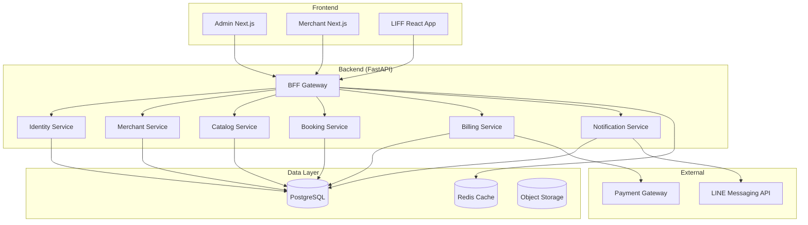

# 專案簡報與產品需求文件 (Project Brief & PRD) - LINE 美甲預約系統

---

**文件版本 (Document Version):** `v1.0`
**最後更新 (Last Updated):** `2025-10-13`
**主要作者 (Lead Author):** `產品經理`
**審核者 (Reviewers):** `技術負責人, UX 設計師`
**狀態 (Status):** `已批准 (Approved)`

---

## 第 1 部分:專案總覽 (Project Overview)

| 區塊 | 內容 |
| :--- | :--- |
| **專案名稱** | LINE 美甲預約系統 (Nail Booking System) |
| **專案代號** | NailBook-MVP |
| **狀態** | 開發中 |
| **目標發布日期** | 2025-11-15 |
| **核心團隊** | PM: VibeCoding Team Lead Engineer: Backend Architect UX Designer: Frontend Lead |

---

## 第 2 部分:商業目標 (Business Objectives) - 「為何做?」

### 2.1 背景與痛點

**市場問題：**
- 美甲店預約管理效率低下，常見電話預約易衝突
- 客戶無法即時查看可用時段，預約體驗差
- 商家缺乏數位化工具整合 LINE 客戶群
- 多分店管理困難，員工排班與服務分配混亂

**嚴重程度：**
- 預約衝突率高達 15-20%
- 客戶流失率因預約不便高達 30%
- 商家每月因預約管理浪費 20+ 小時

### 2.2 策略契合度

本專案支持公司「美容產業數位轉型」戰略目標，具體對齊：
- Q4 目標：推出 SaaS 預約平台 MVP
- 年度目標：服務 100+ 美甲店商家
- 長期願景：成為美容產業預約管理標準解決方案

### 2.3 成功指標 (Success Metrics)

**主要指標 (Primary KPIs)：**
1. **預約成功率：** > 99%（目標：< 1% 衝突率）
2. **商家留存率：** > 80%（6 個月）
3. **客戶滿意度：** NPS > 50

**次要指標 (Secondary KPIs)：**
1. **預約效率提升：** 減少 50% 人工預約時間
2. **LINE 整合率：** > 90% 預約透過 LINE LIFF
3. **系統可用性：** > 99.9% uptime

---

## 第 3 部分:使用者故事與允收標準 (User Stories & UAT) - 「做什麼?」

### 核心史詩 (Core Epic)：預約管理

| 使用者故事 ID | 描述 (As a, I want to, so that) | 核心允收標準 (UAT) | 連結至 BDD 文件 |
| :--- | :--- | :--- | :--- |
| **US-001** | **As a** 美甲店客戶, **I want to** 透過 LINE 查看可預約時段, **so that** 我可以快速選擇適合的時間。 | 1. 可查看特定日期所有可用時段 2. 已被預約的時段不顯示 3. 可篩選特定美甲師 | [bookable_slots.feature](features/bookable_slots.feature) |
| **US-002** | **As a** 美甲店客戶, **I want to** 透過 LINE 建立預約, **so that** 我無需打電話即可完成預約。 | 1. 選擇服務、美甲師、時段 2. 系統防止時段衝突 3. 立即收到 LINE 確認通知 | [create_booking.feature](features/create_booking.feature) |
| **US-003** | **As a** 美甲店老闆, **I want to** 查看所有預約日曆, **so that** 我可以掌握店內排程狀況。 | 1. 可切換日/週/月檢視 2. 可篩選特定美甲師 3. 顯示每筆預約詳情 | [merchant_calendar.feature](features/merchant_calendar.feature) |
| **US-004** | **As a** 美甲店老闆, **I want to** 管理服務項目與價格, **so that** 我可以彈性調整店內服務。 | 1. 新增/編輯/停用服務 2. 設定基礎價格與時長 3. 新增服務選項（加購項） | [catalog_management.feature](features/catalog_management.feature) |
| **US-005** | **As a** 系統管理員, **I want to** 建立新商家並設定訂閱方案, **so that** 新店家可以開始使用系統。 | 1. 輸入商家基本資料 2. 設定 LINE 憑證 3. 啟用訂閱計費 | [merchant_onboarding.feature](features/merchant_onboarding.feature) |

### 核心史詩 (Core Epic)：LINE 整合

| 使用者故事 ID | 描述 | 核心允收標準 (UAT) | 連結至 BDD 文件 |
| :--- | :--- | :--- | :--- |
| **US-010** | **As a** 客戶, **I want to** 預約成功後收到 LINE 通知, **so that** 我可以確認預約詳情。 | 1. 預約成功後 2 秒內發送通知 2. 通知包含時間、地點、服務 3. 推播成功率 > 95% | [line_notification.feature](features/line_notification.feature) |
| **US-011** | **As a** 客戶, **I want to** 在 LINE 中取消預約, **so that** 我可以方便調整行程。 | 1. LIFF 中顯示取消按鈕 2. 取消後立即收到確認通知 3. 釋放時段供其他人預約 | [cancel_booking.feature](features/cancel_booking.feature) |

---

## 第 4 部分:範圍與限制 (Scope & Constraints)

### 4.1 功能性需求 (In Scope)

**核心功能模組：**
- ✅ **預約管理：** 建立、查詢、修改、取消預約
- ✅ **可訂時段計算：** 即時計算員工可預約時段
- ✅ **服務目錄：** 服務項目、選項、員工管理
- ✅ **LINE 整合：** LIFF 預約介面、推播通知
- ✅ **多租戶管理：** 商家隔離、訂閱計費
- ✅ **三前端：** Admin、Merchant、LIFF

### 4.2 非功能性需求 (NFRs)

| NFR 分類 | 具體需求描述 | 衡量指標/目標值 |
| :--- | :--- | :--- |
| **效能 (Performance)** | 預約建立回應時間 | P95 < 300ms |
| | 可訂時段查詢回應時間 | P95 < 200ms |
| **可靠性 (Reliability)** | 預約成功率 | > 99% |
| | 系統可用性 | > 99.9% (SLA) |
| **資料一致性** | 預約衝突率 | < 0.1% |
| | 使用 PG EXCLUDE 約束 | 100% 強一致 |
| **安全性 (Security)** | 租戶資料隔離 | RLS + 應用層驗證 |
| | LINE 憑證加密 | KMS/Vault 管理 |
| **可擴展性** | 支援商家數量 | 初期 100+，可擴展至 1000+ |

### 4.3 不做什麼 (Out of Scope)

**明確排除項目（避免範圍蔓延）：**
- ❌ 不支援線上支付（僅紀錄，實體收款）
- ❌ 不支援多語系（僅繁體中文）
- ❌ 不支援庫存管理（僅預約時段）
- ❌ 不支援客戶評價系統（Phase 2）
- ❌ 不支援行銷活動模組（Phase 2）

### 4.4 假設與依賴

**假設 (Assumptions)：**
1. 商家已有 LINE Official Account
2. 客戶願意透過 LINE 進行預約
3. 網路連線穩定（LIFF 需求）
4. 商家願意支付訂閱費用

**依賴 (Dependencies)：**
1. **LINE Messaging API：** 推播通知功能
2. **LINE LIFF：** 客戶預約介面
3. **Payment Gateway：** 訂閱計費（Stripe/綠界）
4. **PostgreSQL 14+：** EXCLUDE 約束支援

---

## 第 5 部分:待辦問題與決策 (Open Questions & Decisions)

### 5.1 開放議題 (Open Questions)

| 問題/決策 ID | 描述 | 狀態 | 負責人 | 預計解決日期 |
| :--- | :--- | :--- | :--- | :--- |
| **Q-001** | 預約取消政策：是否需要最小取消時間限制？ | 待討論 | PM, 商家代表 | 2025-10-20 |
| **Q-002** | 是否支援等候名單（Waitlist）功能？ | 待討論 | PM, TL | 2025-10-22 |
| **Q-003** | 訂閱方案定價策略？ | 討論中 | PM, Finance | 2025-10-25 |

### 5.2 已決策事項 (Decisions)

| 決策 ID | 描述 | 狀態 | 日期 | ADR 參考 |
| :--- | :--- | :--- | :--- | :--- |
| **D-001** | 採用 PostgreSQL 作為主資料庫 | 已決定 | 2025-10-13 | ADR-001 |
| **D-002** | 使用 EXCLUDE 約束防止預約重疊 | 已決定 | 2025-10-13 | ADR-002 |
| **D-003** | 後端採用 FastAPI + Python 3.11+ | 已決定 | 2025-10-13 | ADR-003 |
| **D-004** | 前端採用 Next.js 14 + React 18 | 已決定 | 2025-10-13 | ADR-004 |
| **D-005** | 多租戶隔離採用 Schema-per-Tenant | 已決定 | 2025-10-13 | ADR-005 |

---

## 第 6 部分:技術架構概覽

### 6.1 高層架構 (High-Level Architecture)

### 6.2 核心領域 (DDD Bounded Contexts)

| Context | 職責 | 主要聚合 |
|---------|------|---------|
| Identity & Access | 使用者、角色、授權 | User, Role, Permission |
| Merchant (Tenant) | 商家主檔、LINE 憑證 | Merchant, ApiKey |
| Catalog | 服務、員工、工時 | Service, Staff, WorkingHours |
| Booking | 預約建立/變更/鎖定 | Booking, BookingLock |
| Billing | 訂閱、帳單、金流 | Subscription, Invoice |
| Notification | LINE 推播、Webhook | MessageTemplate |

---

## 第 7 部分:風險評估與緩解

| 風險 ID | 風險描述 | 可能性 | 影響程度 | 緩解措施 | 負責人 |
|---------|----------|--------|----------|----------|--------|
| R-001 | LINE API 限流影響推播 | 中 | 高 | 實施重試機制 + 快取 | Backend Lead |
| R-002 | 預約衝突導致客訴 | 低 | 高 | PG EXCLUDE 約束 + 測試覆蓋 | Backend Lead |
| R-003 | 多租戶資料洩漏 | 低 | 極高 | RLS 策略 + 安全審計 | Security Engineer |
| R-004 | 效能不符預期 | 中 | 中 | 效能測試 + Redis 快取 | Backend Lead |
| R-005 | 商家不願付費 | 高 | 高 | 提供免費試用 + MVP 驗證 | PM |

---

## 第 8 部分:上線計劃

### Phase 1: MVP (2025-11-15)
- ✅ 核心預約功能
- ✅ LINE LIFF 整合
- ✅ 基礎商家管理
- ✅ 三前端基本功能

### Phase 2: 增強功能 (2025-12-31)
- 等候名單（Waitlist）
- 客戶評價系統
- 行銷活動模組
- 多語系支援

### Phase 3: 規模化 (2026 Q1)
- 多地區部署
- 進階分析報表
- API 開放平台
- 第三方整合

---

**簽核記錄:**

| 角色 | 姓名 | 日期 | 簽名 |
|------|------|------|------|
| 產品經理 | VibeCoding PM | 2025-10-13 | ✅ |
| 技術負責人 | Backend Architect | 2025-10-13 | ✅ |
| UX 設計師 | Frontend Lead | 2025-10-13 | ✅ |

