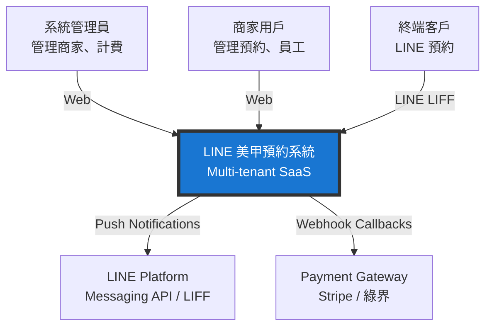
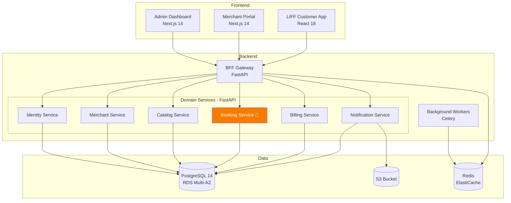
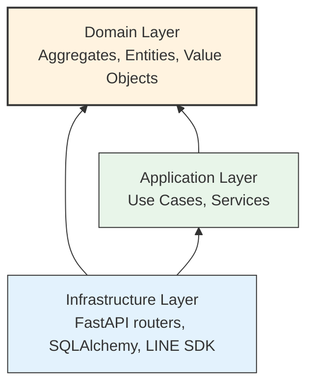
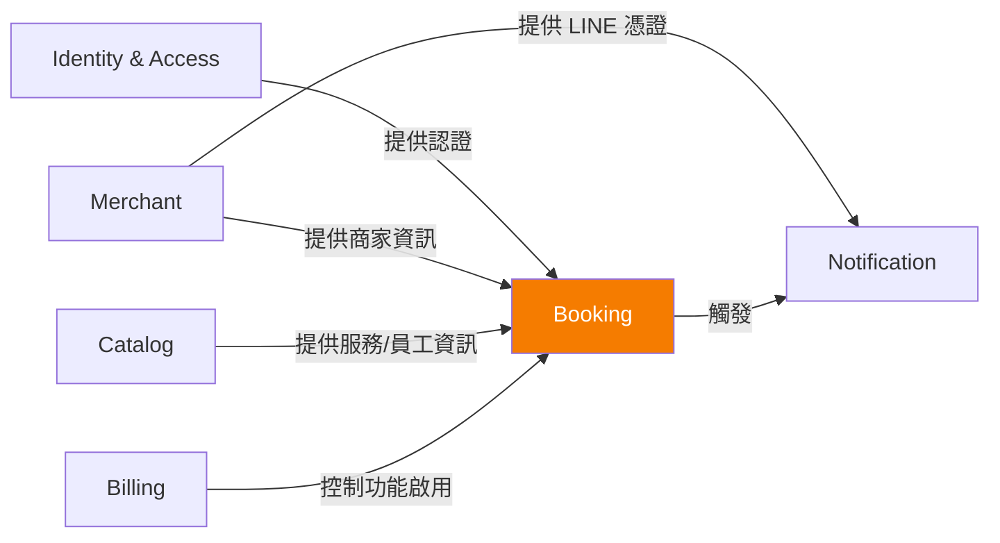
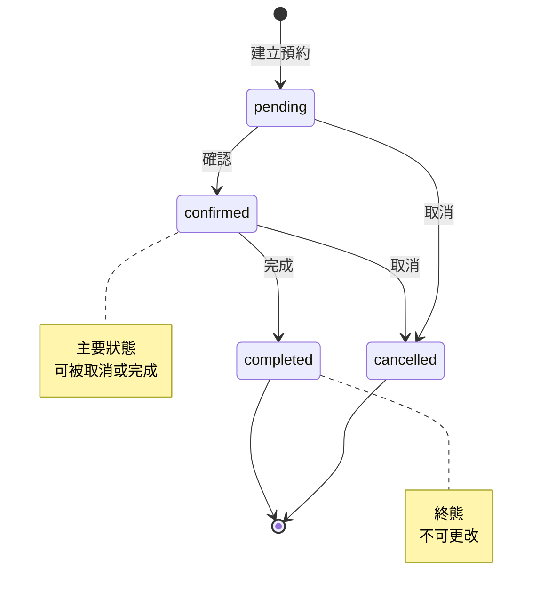

# 整合性架構與設計文件 - LINE 美甲預約系統

---

**文件版本:** `v1.0`
**最後更新:** `2025-10-13`
**主要作者:** `技術架構師`
**審核者:** `架構委員會, 核心開發團隊`
**狀態:** `已批准 (Approved)`

---

## 第 1 部分:架構總覽

### 1.1 系統情境圖 (C4 Level 1)



### 1.2 容器圖 (C4 Level 2)



### 1.3 Clean Architecture 分層



---

## 第 2 部分:DDD 戰略設計

### 2.1 Bounded Contexts 職責矩陣

| Context | 核心職責 | 主要聚合 | 關鍵不變式 | 對外介面 |
|---------|----------|----------|-----------|----------|
| **Identity & Access** | 認證、授權、RBAC | User, Role, Permission | 租戶邊界不可越權 | POST /auth/login<br/>GET /auth/me |
| **Merchant** | 商家檔案、LINE 設定 | Merchant, ApiKey | 狀態為 active 才能接受預約 | GET /merchants/{id}<br/>PUT /merchants/{id} |
| **Catalog** | 服務、員工、工時 | Service, Staff, WorkingHours | Service + Staff 均 active 才可預約 | GET /merchants/{id}/services<br/>POST /staffs |
| **Booking** 🎯 | 預約生命週期、衝突防護 | Booking, BookingLock | 同一員工同時間無重疊 | POST /bookings<br/>GET /bookings/{id} |
| **Billing** | 訂閱、帳單、付款 | Subscription, Invoice | 逾期則 disable 新預約 | POST /subscriptions<br/>Webhook /billing/callback |
| **Notification** | LINE 推播、模板 | MessageTemplate | 推播對應正確 channel token | POST /notifications/push |

### 2.2 Context Map (關係圖)



---

## 第 3 部分:Booking Context 詳細設計（核心）

### 3.1 Booking 聚合設計

**聚合根：** `Booking`

**包含實體/值物件：**
- `BookingItem`（值物件）
- `Money`（值物件）
- `Duration`（值物件）
- `BookingLock`（關聯實體，用於防重疊）

**不變式（Invariants）：**
```python
class Booking:
    """
    不變式：
    1. total_price = Σ(item.service_price + Σ item.option_prices)
    2. total_duration = Σ(item.service_duration + Σ item.option_durations)
    3. end_at = start_at + total_duration
    4. 同一 staff_id 同時間不可重疊（由 BookingLock.EXCLUDE 保證）
    5. 狀態轉移規則：
       - pending → confirmed ✅
       - confirmed → completed ✅
       - confirmed → cancelled ✅
       - completed → cancelled ❌
       - cancelled → confirmed ❌
    """
```

**狀態轉移圖：**



### 3.2 核心演算法：可訂時段計算

**演算法邏輯：**

```
Input: merchant_id, staff_id, date, service_duration_min
Output: List[Slot{start_time, end_time}]

Algorithm:
1. working_hours = GET staff_working_hours WHERE date.weekday = day_of_week
2. booked_ranges = GET bookings + booking_locks WHERE staff_id AND date
3. available_ranges = working_hours ∩ (NOT booked_ranges)
4. slots = SPLIT available_ranges INTO interval_min chunks
5. FILTER slots WHERE duration >= service_duration_min
6. RETURN slots
```

**Python 實作：**

```python
def calculate_available_slots(
    merchant_id: int,
    staff_id: int,
    target_date: datetime.date,
    service_duration_min: int,
    interval_min: int = 30
) -> list[dict]:
    """
    計算可訂時段
    
    時間複雜度: O(n log n) where n = 已訂時段數量
    空間複雜度: O(n)
    """
    
    # 1. 取得員工工時
    working_hours = db.query(StaffWorkingHours).filter(
        StaffWorkingHours.staff_id == staff_id,
        StaffWorkingHours.day_of_week == target_date.weekday(),
        StaffWorkingHours.is_active == True
    ).all()
    
    if not working_hours:
        return []
    
    # 2. 組合工時區間
    work_ranges = []
    for wh in working_hours:
        start_dt = datetime.combine(target_date, wh.start_time, tzinfo=TZ)
        end_dt = datetime.combine(target_date, wh.end_time, tzinfo=TZ)
        work_ranges.append((start_dt, end_dt))
    
    # 3. 取得已佔用時段（Bookings + Locks）
    occupied = db.query(
        BookingLock.start_at,
        BookingLock.end_at
    ).filter(
        BookingLock.merchant_id == merchant_id,
        BookingLock.staff_id == staff_id,
        func.date(BookingLock.start_at) == target_date
    ).all()
    
    occupied_ranges = [(occ.start_at, occ.end_at) for occ in occupied]
    
    # 4. 計算可用區間（集合運算）
    available_ranges = subtract_time_ranges(work_ranges, occupied_ranges)
    
    # 5. 切片為固定間隔的時段
    slots = []
    for start, end in available_ranges:
        current = start
        while current + timedelta(minutes=service_duration_min) <= end:
            slots.append({
                'start_time': current.isoformat(),
                'end_time': (current + timedelta(minutes=service_duration_min)).isoformat(),
                'available': True
            })
            current += timedelta(minutes=interval_min)
    
    return slots

def subtract_time_ranges(work_ranges, occupied_ranges):
    """時間區間減法（集合運算）"""
    result = []
    
    for work_start, work_end in work_ranges:
        current_start = work_start
        
        # 排序已佔用區間
        occupied_sorted = sorted(occupied_ranges, key=lambda x: x[0])
        
        for occ_start, occ_end in occupied_sorted:
            # 如果佔用區間在工作時間之前，跳過
            if occ_end <= current_start:
                continue
            # 如果佔用區間在工作時間之後，結束
            if occ_start >= work_end:
                break
            # 如果有空檔，加入結果
            if current_start < occ_start:
                result.append((current_start, min(occ_start, work_end)))
            # 移動當前指針
            current_start = max(current_start, occ_end)
        
        # 處理最後一段
        if current_start < work_end:
            result.append((current_start, work_end))
    
    return result
```

---

## 第 4 部分:資料庫 Schema 詳細設計

### 4.1 核心資料表（PostgreSQL DDL）

```sql
-- ====================
-- Merchant Context
-- ====================

CREATE TABLE merchants (
    id SERIAL PRIMARY KEY,
    slug VARCHAR(100) UNIQUE NOT NULL,
    name VARCHAR(200) NOT NULL,
    status VARCHAR(20) NOT NULL DEFAULT 'active',  -- active, suspended, cancelled
    line_channel_id VARCHAR(100),
    line_channel_secret TEXT,  -- encrypted
    line_channel_access_token TEXT,  -- encrypted
    line_bot_basic_id VARCHAR(100),
    timezone VARCHAR(50) NOT NULL DEFAULT 'Asia/Taipei',
    address TEXT,
    phone VARCHAR(20),
    metadata JSONB,
    created_at TIMESTAMPTZ NOT NULL DEFAULT NOW(),
    updated_at TIMESTAMPTZ NOT NULL DEFAULT NOW(),
    
    CHECK (status IN ('active', 'suspended', 'cancelled'))
);

CREATE INDEX idx_merchants_slug ON merchants(slug);
CREATE INDEX idx_merchants_status ON merchants(status) WHERE status = 'active';

-- ====================
-- Catalog Context
-- ====================

CREATE TABLE services (
    id SERIAL PRIMARY KEY,
    merchant_id INT NOT NULL REFERENCES merchants(id) ON DELETE CASCADE,
    name VARCHAR(200) NOT NULL,
    description TEXT,
    base_price DECIMAL(10,2) NOT NULL CHECK (base_price >= 0),
    base_duration_min INT NOT NULL CHECK (base_duration_min > 0),
    is_active BOOLEAN NOT NULL DEFAULT true,
    allow_stack BOOLEAN NOT NULL DEFAULT true,
    display_order INT NOT NULL DEFAULT 0,
    created_at TIMESTAMPTZ NOT NULL DEFAULT NOW(),
    updated_at TIMESTAMPTZ NOT NULL DEFAULT NOW()
);

CREATE INDEX idx_services_merchant_active ON services(merchant_id) WHERE is_active = true;

CREATE TABLE service_options (
    id SERIAL PRIMARY KEY,
    service_id INT NOT NULL REFERENCES services(id) ON DELETE CASCADE,
    name VARCHAR(200) NOT NULL,
    add_price DECIMAL(10,2) NOT NULL CHECK (add_price >= 0),
    add_duration_min INT NOT NULL CHECK (add_duration_min >= 0),
    is_active BOOLEAN NOT NULL DEFAULT true,
    display_order INT NOT NULL DEFAULT 0,
    created_at TIMESTAMPTZ NOT NULL DEFAULT NOW()
);

CREATE TABLE staffs (
    id SERIAL PRIMARY KEY,
    merchant_id INT NOT NULL REFERENCES merchants(id) ON DELETE CASCADE,
    name VARCHAR(100) NOT NULL,
    email VARCHAR(255),
    phone VARCHAR(20),
    is_active BOOLEAN NOT NULL DEFAULT true,
    skills JSONB,  -- ["gel_nails", "classic_manicure", "nail_art"]
    avatar_url TEXT,
    created_at TIMESTAMPTZ NOT NULL DEFAULT NOW(),
    updated_at TIMESTAMPTZ NOT NULL DEFAULT NOW()
);

CREATE INDEX idx_staffs_merchant_active ON staffs(merchant_id) WHERE is_active = true;

CREATE TABLE staff_working_hours (
    id SERIAL PRIMARY KEY,
    staff_id INT NOT NULL REFERENCES staffs(id) ON DELETE CASCADE,
    day_of_week INT NOT NULL CHECK (day_of_week BETWEEN 0 AND 6),  -- 0=Monday
    start_time TIME NOT NULL,
    end_time TIME NOT NULL,
    is_active BOOLEAN NOT NULL DEFAULT true,
    
    CHECK (end_time > start_time)
);

CREATE INDEX idx_staff_hours ON staff_working_hours(staff_id, day_of_week) WHERE is_active = true;

-- ====================
-- Booking Context 🎯
-- ====================

-- 擴展：啟用 GiST 對 Range Types 的支援
CREATE EXTENSION IF NOT EXISTS btree_gist;

CREATE TABLE booking_locks (
    id SERIAL PRIMARY KEY,
    merchant_id INT NOT NULL REFERENCES merchants(id),
    staff_id INT NOT NULL REFERENCES staffs(id),
    start_at TIMESTAMPTZ NOT NULL,
    end_at TIMESTAMPTZ NOT NULL,
    booking_id INT,  -- 關聯實際預約
    created_at TIMESTAMPTZ NOT NULL DEFAULT NOW(),
    
    CHECK (end_at > start_at)
);

-- 🎯 核心約束：防止重疊
ALTER TABLE booking_locks
  ADD CONSTRAINT no_overlap_bookings
  EXCLUDE USING gist (
    merchant_id WITH =,
    staff_id WITH =,
    tstzrange(start_at, end_at) WITH &&
  );

CREATE INDEX idx_booking_locks_staff_time ON booking_locks 
  USING gist (staff_id, tstzrange(start_at, end_at));

CREATE TABLE bookings (
    id SERIAL PRIMARY KEY,
    merchant_id INT NOT NULL REFERENCES merchants(id),
    customer JSONB NOT NULL,  -- {line_user_id, name?, phone?}
    staff_id INT NOT NULL REFERENCES staffs(id),
    status VARCHAR(20) NOT NULL DEFAULT 'pending',
    start_at TIMESTAMPTZ NOT NULL,
    end_at TIMESTAMPTZ NOT NULL,
    items JSONB NOT NULL,  -- BookingItem[] with service + options
    total_price_amount DECIMAL(10,2) NOT NULL,
    total_price_currency VARCHAR(3) NOT NULL DEFAULT 'TWD',
    total_duration_min INT NOT NULL,
    notes TEXT,
    created_at TIMESTAMPTZ NOT NULL DEFAULT NOW(),
    confirmed_at TIMESTAMPTZ,
    cancelled_at TIMESTAMPTZ,
    completed_at TIMESTAMPTZ,
    
    CHECK (status IN ('pending', 'confirmed', 'completed', 'cancelled')),
    CHECK (end_at > start_at),
    CHECK (total_price_amount >= 0),
    CHECK (total_duration_min > 0)
);

CREATE INDEX idx_bookings_merchant_staff_time ON bookings(merchant_id, staff_id, start_at);
CREATE INDEX idx_bookings_customer ON bookings USING gin ((customer->'line_user_id'));
CREATE INDEX idx_bookings_status ON bookings(status);

-- ====================
-- Billing Context
-- ====================

CREATE TABLE plans (
    id SERIAL PRIMARY KEY,
    name VARCHAR(100) NOT NULL,
    price_amount DECIMAL(10,2) NOT NULL,
    billing_interval VARCHAR(20) NOT NULL,  -- monthly, yearly
    max_bookings_per_month INT,
    features JSONB,
    is_active BOOLEAN NOT NULL DEFAULT true,
    created_at TIMESTAMPTZ NOT NULL DEFAULT NOW()
);

CREATE TABLE subscriptions (
    id SERIAL PRIMARY KEY,
    merchant_id INT NOT NULL REFERENCES merchants(id),
    plan_id INT NOT NULL REFERENCES plans(id),
    status VARCHAR(20) NOT NULL DEFAULT 'active',  -- active, past_due, cancelled
    current_period_start TIMESTAMPTZ NOT NULL,
    current_period_end TIMESTAMPTZ NOT NULL,
    cancel_at TIMESTAMPTZ,
    created_at TIMESTAMPTZ NOT NULL DEFAULT NOW(),
    
    CHECK (status IN ('active', 'past_due', 'cancelled', 'trialing'))
);

CREATE INDEX idx_subscriptions_merchant ON subscriptions(merchant_id);

CREATE TABLE invoices (
    id SERIAL PRIMARY KEY,
    subscription_id INT NOT NULL REFERENCES subscriptions(id),
    amount DECIMAL(10,2) NOT NULL,
    currency VARCHAR(3) NOT NULL DEFAULT 'TWD',
    status VARCHAR(20) NOT NULL DEFAULT 'pending',  -- pending, paid, past_due, void
    due_date DATE NOT NULL,
    paid_at TIMESTAMPTZ,
    created_at TIMESTAMPTZ NOT NULL DEFAULT NOW()
);

-- ====================
-- Notification Context
-- ====================

CREATE TABLE notification_logs (
    id SERIAL PRIMARY KEY,
    merchant_id INT NOT NULL REFERENCES merchants(id),
    recipient_line_user_id VARCHAR(100) NOT NULL,
    template_type VARCHAR(50) NOT NULL,  -- booking_confirmed, booking_cancelled, etc.
    payload JSONB NOT NULL,
    status VARCHAR(20) NOT NULL DEFAULT 'pending',  -- pending, sent, failed
    line_response JSONB,
    error_reason TEXT,
    sent_at TIMESTAMPTZ,
    created_at TIMESTAMPTZ NOT NULL DEFAULT NOW()
);

CREATE INDEX idx_noti_logs_status ON notification_logs(status) WHERE status = 'pending';
```

### 4.2 索引策略

| 資料表 | 索引類型 | 欄位 | 目的 |
|--------|----------|------|------|
| booking_locks | GiST | (staff_id, tstzrange(start_at, end_at)) | 快速重疊查詢 |
| bookings | B-Tree | (merchant_id, staff_id, start_at) | 日曆檢視查詢 |
| bookings | GIN | (customer->'line_user_id') | 客戶預約歷史 |
| staffs | Partial | (merchant_id) WHERE is_active | 僅索引活躍員工 |
| services | Partial | (merchant_id) WHERE is_active | 僅索引活躍服務 |

---

## 第 5 部分:API 設計概覽

### 5.1 BFF 層 API 端點分層

| 層級 | 路徑前綴 | 認證 | 目的 |
|------|---------|------|------|
| Public | `/public/*` | None | 公開資訊（商家、服務） |
| LIFF | `/liff/*` | JWT (scope=liff) | 客戶預約功能 |
| Merchant | `/merchant/*` | JWT (scope=merchant) | 商家管理功能 |
| Admin | `/admin/*` | JWT (scope=admin) | 系統管理功能 |

### 5.2 核心端點清單

| 方法 | 路徑 | 目的 | 回應時間目標 |
|------|------|------|-------------|
| GET | `/public/merchants/{slug}` | 商家公開資訊 | < 100ms |
| GET | `/public/merchants/{slug}/services` | 服務列表 | < 100ms |
| GET | `/public/merchants/{slug}/slots` | 可訂時段 🎯 | < 200ms |
| POST | `/liff/bookings` | 建立預約 🎯 | < 300ms |
| GET | `/liff/bookings/{id}` | 預約詳情 | < 100ms |
| DELETE | `/liff/bookings/{id}` | 取消預約 | < 200ms |
| GET | `/merchant/bookings` | 預約列表 | < 150ms |
| GET | `/merchant/calendar` | 日曆檢視 | < 200ms |
| POST | `/admin/merchants` | 建立商家 | < 500ms |
| POST | `/admin/merchants/{id}/subscribe` | 啟用訂閱 | < 300ms |

---

## 第 6 部分:非功能性需求設計

### 6.1 效能 (Performance)

**目標：**
- 預約建立 P95 < 300ms
- 可訂查詢 P95 < 200ms
- 日曆查詢 P95 < 200ms

**策略：**
1. **Redis 快取：**
   - 商家資訊（TTL 1小時）
   - 服務列表（TTL 30分鐘）
   - 員工資訊（TTL 15分鐘）

2. **Read Replica：**
   - 查詢類端點使用 Read Replica
   - 寫入端點使用 Primary

3. **連接池：**
   - PostgreSQL: pool_size=20, max_overflow=10
   - Redis: pool_size=50

### 6.2 可靠性 (Reliability)

**目標：**
- API 可用性 > 99.9%（每月停機 < 43分鐘）
- 預約衝突率 < 0.1%
- 資料零遺失（RPO = 0）

**策略：**
1. **Multi-AZ 部署：** RDS PostgreSQL Multi-AZ
2. **自動容錯移轉：** < 2 分鐘
3. **PITR 備份：** 每 5 分鐘一次 WAL 歸檔
4. **健康檢查：** `/health` 端點，檢查 DB + Redis 連線

### 6.3 安全性 (Security)

**威脅模型（STRIDE）：**

| 威脅 | 緩解措施 |
|------|----------|
| **Spoofing（假冒）** | JWT 認證 + LINE LIFF ID Token 驗證 |
| **Tampering（竄改）** | PostgreSQL RLS + 應用層租戶驗證 |
| **Repudiation（否認）** | audit_logs 記錄所有變更 |
| **Information Disclosure（洩漏）** | TLS 1.3 + 欄位加密（LINE credentials） |
| **Denial of Service（阻斷）** | Rate Limiting（100 req/min per IP） |
| **Elevation of Privilege（提權）** | RBAC + 最小權限原則 |

---

## 第 7 部分:技術選型

| 分類 | 選用技術 | 版本 | 理由 | ADR |
|------|----------|------|------|-----|
| **後端框架** | FastAPI | 0.104+ | 高效能、自動文檔、型別安全 | ADR-003 |
| **資料庫** | PostgreSQL | 14+ | EXCLUDE 約束、Range Types | ADR-001 |
| **快取** | Redis | 7+ | Session、Queue、快取 | ADR-006 |
| **ORM** | SQLAlchemy | 2.0+ | 成熟穩定、Type Hints 支援 | ADR-007 |
| **前端框架** | Next.js + React | 14 + 18 | SSR、效能優異 | ADR-004 |
| **狀態管理** | Zustand | 4+ | 輕量、簡潔 | ADR-008 |
| **任務佇列** | Celery | 5+ | 成熟、支援排程 | ADR-009 |
| **部署** | AWS ECS Fargate | - | 無需管理伺服器 | ADR-010 |
| **監控** | Grafana + Prometheus | - | 開源、可自訂 | ADR-011 |

---

**簽核記錄:**

| 日期 | 審核人 | 角色 | 狀態 |
|------|--------|------|------|
| 2025-10-13 | 技術架構師 | Architecture | ✅ 批准 |
| 2025-10-13 | DBA | Database | ✅ 批准 |
| 2025-10-13 | Security Engineer | Security | ✅ 批准 |

