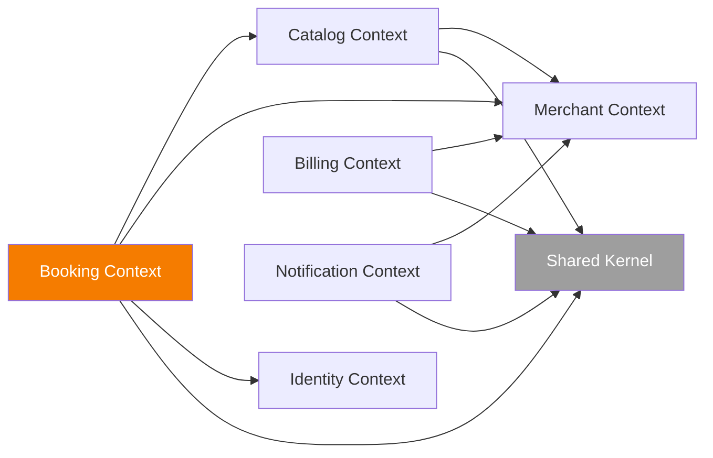
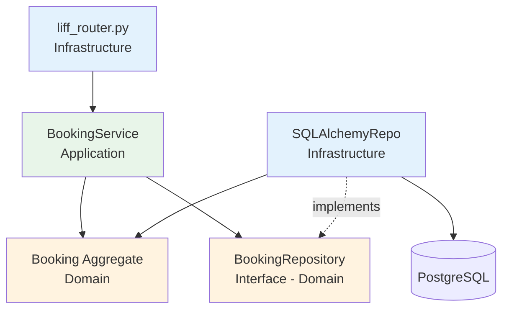
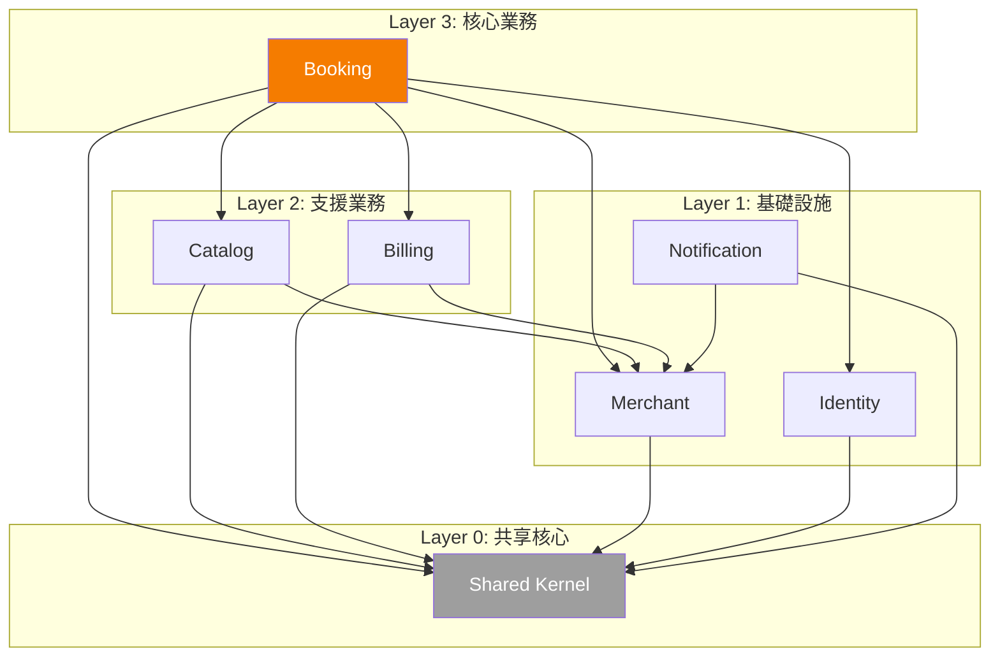

# 模組依賴關係分析 - LINE 美甲預約系統

---

**文件版本:** `v1.0`
**最後更新:** `2025-10-13`
**主要作者:** `技術架構師`
**狀態:** `已批准 (Approved)`

---

## 1. 概述

### 1.1 文檔目的
分析 LINE 美甲預約系統的內部模組與外部套件依賴關係，確保遵循 Clean Architecture 與依賴倒置原則。

### 1.2 分析範圍
- **分析層級：** Package-level（Bounded Context 層級）
- **包含範圍：** 應用程式原始碼內部依賴、外部函式庫依賴
- **排除項目：** Python 標準庫、開發工具（pytest, black, ruff）

---

## 2. 核心依賴原則

### 2.1 Clean Architecture 依賴規則

```
Infrastructure Layer
        ↓ (depends on)
Application Layer
        ↓ (depends on)
  Domain Layer
        ↑ (NEVER depends on anything)
```

**關鍵原則：**
1. **Domain Layer 純淨：** 不依賴任何外部框架（FastAPI、SQLAlchemy）
2. **Application Layer：** 可依賴 Domain，定義 Repository 介面
3. **Infrastructure Layer：** 實作 Repository 介面，依賴 Domain

### 2.2 Bounded Context 依賴原則



**規則：**
- ✅ Booking 可依賴 Catalog（需查詢服務/員工資訊）
- ✅ 所有 Context 可依賴 Shared Kernel
- ❌ Catalog 不可依賴 Booking（單向依賴）
- ❌ 任何 Context 不可循環依賴

---

## 3. 高層級模組依賴

### 3.1 Booking Context 依賴分析

```python
# booking/domain/models.py
from shared.value_objects import Money, Duration  # ✅ 允許
from datetime import datetime  # ✅ 標準庫
# ❌ 不可 import SQLAlchemy
# ❌ 不可 import FastAPI

# booking/application/services.py
from booking.domain.models import Booking  # ✅
from booking.domain.repositories import BookingRepository  # ✅
from catalog.application.services import CatalogService  # ✅ 跨 Context
# ❌ 不可 import booking.infrastructure（反向依賴）

# booking/infrastructure/repositories/sqlalchemy_booking_repository.py
from booking.domain.repositories import BookingRepository  # ✅ 實作介面
from booking.domain.models import Booking  # ✅
from sqlalchemy import select  # ✅ Infrastructure 可依賴外部框架
```

### 3.2 依賴矩陣

| From \ To | Domain | Application | Infrastructure | External |
|-----------|--------|-------------|----------------|----------|
| **Domain** | ✅ | ❌ | ❌ | ❌ (僅標準庫) |
| **Application** | ✅ | ✅ | ❌ | ✅ (業務邏輯庫) |
| **Infrastructure** | ✅ | ✅ | ✅ | ✅ (框架、DB) |

---

## 4. 關鍵依賴路徑分析

### 4.1 場景：建立預約

**依賴調用鏈：**

```
1. liff_router.py (Infrastructure)
   ↓ calls
2. BookingService.create_booking (Application)
   ↓ uses
3. Booking.validate_invariants (Domain)
   ↓ calls
4. BookingRepository.save (Domain Interface)
   ↓ implemented by
5. SQLAlchemyBookingRepository.save (Infrastructure)
   ↓ accesses
6. PostgreSQL Database
```

**依賴圖：**



**結論：** 符合依賴倒置原則（DIP），Application 依賴 Domain 介面，Infrastructure 實作介面。

---

## 5. 外部依賴管理

### 5.1 Python 後端依賴清單

| 外部依賴 | 版本 | 用途說明 | 風險評估 | ADR |
|----------|------|----------|----------|-----|
| `fastapi` | ^0.104.0 | Web 框架 | 低（成熟穩定） | ADR-003 |
| `sqlalchemy` | ^2.0.0 | ORM | 低（成熟穩定） | ADR-007 |
| `pydantic` | ^2.4.0 | 資料驗證 | 低（成熟穩定） | - |
| `alembic` | ^1.12.0 | 資料庫遷移 | 低（成熟穩定） | - |
| `celery` | ^5.3.0 | 背景任務 | 低（成熟穩定） | ADR-009 |
| `redis` | ^5.0.0 | 快取/佇列 | 低（成熟穩定） | ADR-006 |
| `line-bot-sdk` | ^3.5.0 | LINE 整合 | 中（官方SDK） | - |
| `stripe` | ^7.0.0 | 計費整合 | 中（官方SDK） | - |
| `cryptography` | ^41.0.0 | 加密 | 低（成熟穩定） | - |
| `python-jose` | ^3.3.0 | JWT | 低（成熟穩定） | - |

### 5.2 TypeScript 前端依賴清單

| 外部依賴 | 版本 | 用途說明 | 風險評估 |
|----------|------|----------|----------|
| `next` | ^14.0.0 | React 框架 | 低（成熟穩定） |
| `react` | ^18.2.0 | UI 函式庫 | 低（成熟穩定） |
| `zustand` | ^4.4.0 | 狀態管理 | 低（輕量穩定） |
| `@tanstack/react-query` | ^5.0.0 | Server State | 低（成熟穩定） |
| `@liff/liff` | ^2.23.0 | LINE LIFF SDK | 中（官方SDK） |
| `axios` | ^1.5.0 | HTTP 客戶端 | 低（成熟穩定） |
| `date-fns` | ^2.30.0 | 日期處理 | 低（成熟穩定） |
| `zod` | ^3.22.0 | Schema 驗證 | 低（成熟穩定） |

---

## 6. 依賴風險與管理

### 6.1 循環依賴檢測

**檢測工具：**
```bash
# Python
pip install pydeps
pydeps src/booking --max-bacon=2 --cluster

# 檢查循環
pydeps src --show-cycles
```

**預防措施：**
- 每次 PR 自動執行循環依賴檢測
- 禁止跨 Bounded Context 的直接模型依賴
- 使用事件驅動解耦（Event Bus）

### 6.2 依賴更新策略

**自動化工具：**
- Python: Dependabot
- TypeScript: Renovate Bot

**更新流程：**
1. Dependabot 建立 PR
2. CI 執行完整測試套件
3. 安全掃描（Snyk）
4. Code Review
5. 合併至 main

---

## 7. 依賴圖視覺化

### 7.1 Bounded Context 依賴層級



---

**維護建議：**
- 每月更新依賴版本
- 每季度重新評估依賴結構
- 記錄所有架構決策（ADR）

