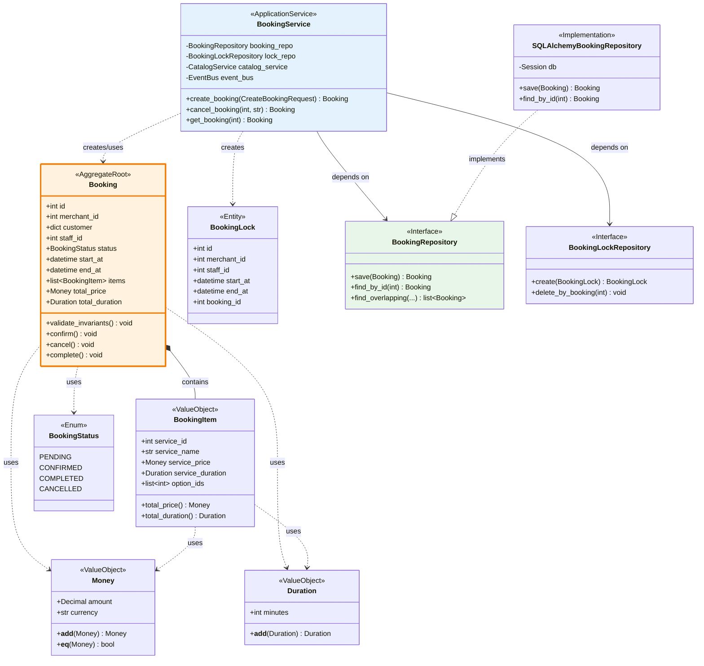

# 類別/組件關係文檔 - Booking Context

---

**文件版本:** `v1.0`
**最後更新:** `2025-10-13`
**主要作者:** `後端架構師`
**審核者:** `技術負責人`
**狀態:** `已批准 (Approved)`

**相關設計文檔:**
- 系統架構文檔: [05_architecture_and_design_document.md](./05_architecture_and_design_document.md)
- API 設計規範: [06_api_design_specification.md](./06_api_design_specification.md)

---

## 1. 概述

### 1.1 文檔目的
呈現 Booking Context 核心類別的靜態結構關係，確保設計遵循 SOLID 原則與 DDD 模式。

### 1.2 建模範圍
- **包含範圍：** Booking 聚合、值物件、Repository 介面、Application Service
- **排除範圍：** ORM 模型、FastAPI Router、測試類別
- **抽象層級：** 公開方法與屬性，忽略私有實作細節

---

## 2. 核心類別圖



---

## 3. 主要類別職責

| 類別/組件 | 核心職責 | 主要協作者 | 所屬層級 |
|-----------|----------|-----------|----------|
| `Booking` | 預約聚合根，維護預約不變式、狀態轉移 | Money, Duration, BookingItem | Domain |
| `BookingItem` | 預約項目值物件，計算單項價格與時長 | Money, Duration | Domain |
| `Money` | 金額值物件，支援加法運算 | - | Domain (Shared) |
| `Duration` | 時長值物件，支援加法運算 | - | Domain (Shared) |
| `BookingLock` | 防重疊鎖定實體 | - | Domain |
| `BookingRepository` | 預約倉儲介面，定義持久化契約 | Booking | Domain |
| `BookingService` | 應用服務，編排預約建立流程 | Booking, Repository, CatalogService | Application |
| `SQLAlchemyBookingRepository` | Repository 實作，處理 ORM 與 Domain Model 轉換 | Booking, BookingORM | Infrastructure |

---

## 4. 關係詳解

### 4.1 組合 (Composition)

**Booking *-- BookingItem:**
- `Booking` 聚合根**擁有** `BookingItem` 值物件
- `BookingItem` 的生命週期完全依賴於 `Booking`
- 刪除 `Booking` 時，所有 `BookingItem` 也被刪除（在 JSONB 欄位中）

### 4.2 依賴 (Dependency)

**BookingService ..> BookingRepository:**
- `BookingService` **使用** `BookingRepository` 介面
- 透過依賴注入（DI）傳入具體實作
- 符合依賴倒置原則（DIP）

**範例：**
```python
class BookingService:
    def __init__(self, booking_repo: BookingRepository):
        self.booking_repo = booking_repo  # 依賴介面，非實作
```

### 4.3 實現 (Implementation)

**SQLAlchemyBookingRepository ..|> BookingRepository:**
- 策略模式應用
- Infrastructure 層實作 Domain 層定義的介面
- 可輕易替換為其他實作（如 MongoBookingRepository）

---

## 5. 設計模式應用

| 設計模式 | 應用場景 | 設計目的 |
|---------|---------|---------|
| **Repository Pattern** | BookingRepository 介面 | 將資料存取邏輯與業務邏輯分離 |
| **Value Object Pattern** | Money, Duration, BookingItem | 透過值相等性保證一致性 |
| **Aggregate Pattern** | Booking 聚合根 | 定義交易邊界與一致性邊界 |
| **Domain Event Pattern** | BookingConfirmed, BookingCancelled | 解耦領域間的協作 |
| **Dependency Injection** | BookingService 建構子 | 降低耦合，提高可測試性 |
| **Strategy Pattern** | BookingRepository 多實作 | 運行時切換資料存取策略 |

---

## 6. SOLID 原則遵循情況

### ✅ S - 單一職責原則 (SRP)
- `Booking`: 僅負責預約聚合的業務規則
- `BookingService`: 僅負責編排預約建立流程
- `BookingRepository`: 僅負責資料持久化

### ✅ O - 開放/封閉原則 (OCP)
- 新增其他資料庫實作（如 MongoDB）無需修改 `BookingService`
- 新增預約狀態無需修改核心邏輯（使用 Enum）

### ✅ L - 里氏替換原則 (LSP)
- 任何 `BookingRepository` 的實作都可替換基礎介面
- `SQLAlchemyBookingRepository` 完全遵守 `BookingRepository` 的契約

### ✅ I - 介面隔離原則 (ISP)
- `BookingRepository` 僅定義預約相關操作
- `BookingLockRepository` 獨立介面，職責單一

### ✅ D - 依賴反轉原則 (DIP)
- `BookingService` 依賴 `BookingRepository` 介面（抽象）
- 不依賴 `SQLAlchemyBookingRepository`（具體實作）

---

## 7. 接口契約

### 7.1 BookingRepository

```python
from abc import ABC, abstractmethod
from typing import Optional

class BookingRepository(ABC):
    """
    預約倉儲介面
    
    目的：定義預約持久化的契約，獨立於具體資料庫實作
    """
    
    @abstractmethod
    def save(self, booking: Booking) -> Booking:
        """
        儲存或更新預約
        
        前置條件：
        - booking 是有效的 Booking 實例
        - booking.validate_invariants() 無異常
        
        後置條件：
        - booking.id 被設定（若為新建）
        - 資料已持久化
        
        異常：
        - IntegrityError: 違反資料庫約束
        """
        pass
    
    @abstractmethod
    def find_by_id(self, booking_id: int) -> Optional[Booking]:
        """
        根據 ID 查詢預約
        
        前置條件：
        - booking_id > 0
        
        後置條件：
        - 若存在，返回完整 Booking 物件（含 items）
        - 若不存在，返回 None
        """
        pass
    
    @abstractmethod
    def find_overlapping(
        self,
        merchant_id: int,
        staff_id: int,
        start_at: datetime,
        end_at: datetime,
        exclude_booking_id: Optional[int] = None
    ) -> list[Booking]:
        """
        查詢重疊預約
        
        前置條件：
        - merchant_id > 0
        - staff_id > 0
        - end_at > start_at
        
        後置條件：
        - 返回所有與 [start_at, end_at) 重疊的預約
        - 若 exclude_booking_id 提供，排除該預約
        """
        pass
```

---

## 8. 技術選型與依賴

| 類別/組件 | 語言/框架 | 關鍵庫/工具 | 版本 | 理由 | ADR |
|-----------|----------|-------------|------|------|-----|
| `Booking` | Python | Pydantic | 2.4+ | 型別安全、驗證 | - |
| `BookingService` | Python / FastAPI | - | 3.11+ | 清晰的型別提示 | ADR-003 |
| `SQLAlchemyRepo` | Python | SQLAlchemy | 2.0+ | 成熟的 ORM | ADR-007 |
| Money/Duration | Python | Pydantic | 2.4+ | 值物件不變性 | - |

---

**簽核記錄:**

| 日期 | 審核人 | 角色 | 狀態 |
|------|--------|------|------|
| 2025-10-13 | 後端架構師 | Architecture | ✅ |
| 2025-10-13 | 技術負責人 | Technical Lead | ✅ |

