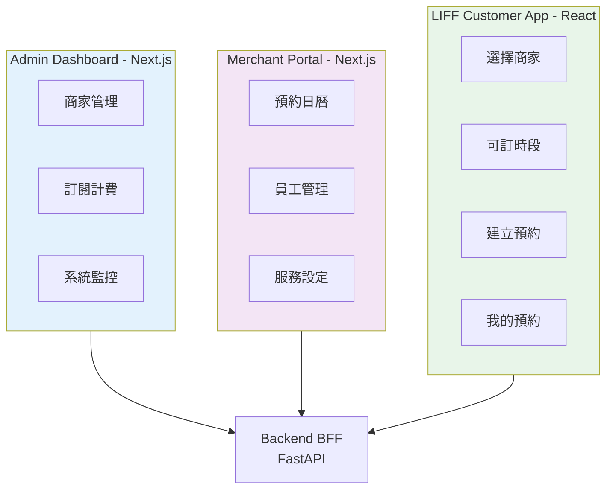
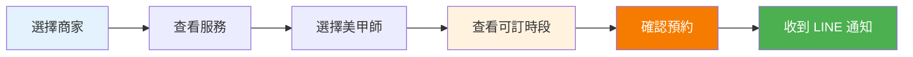

# 前端架構與開發規範 - LINE 美甲預約系統

---

**文件版本:** `v1.0`
**最後更新:** `2025-10-13`
**主要作者:** `前端架構師`
**審核者:** `UX 設計師, 技術負責人`
**狀態:** `已批准 (Approved)`

---

## 第一部分：三前端策略

### 1.1 前端架構總覽



### 1.2 技術棧選擇

| 前端 | 框架 | 狀態管理 | UI 庫 | 部署 | 理由 |
|------|------|----------|-------|------|------|
| **Admin** | Next.js 14 | Zustand | shadcn/ui | Vercel | SSR、SEO、開發效率 |
| **Merchant** | Next.js 14 | Zustand | shadcn/ui | Vercel | 與 Admin 共用元件庫 |
| **LIFF** | React 18 + Vite | Zustand | Tailwind CSS | Cloudflare Pages | 輕量、快速載入 |

**共通決策：**
- **TypeScript：** 100% 型別覆蓋
- **React Query：** 管理 Server State
- **Zod：** Schema 驗證
- **date-fns：** 時間處理（支援時區）

---

## 第二部分：LIFF 客戶端設計（核心）

### 2.1 用戶旅程



### 2.2 頁面結構

| 頁面 | 路由 | 職責 | 主要組件 |
|------|------|------|----------|
| 商家選擇 | `/` | 列出商家或掃碼進入 | MerchantCard |
| 服務選擇 | `/merchants/:slug` | 展示服務、選項 | ServiceList, ServiceCard |
| 時段選擇 | `/booking/new` | 可訂時段選擇 | SlotPicker, Calendar |
| 預約確認 | `/booking/confirm` | 確認預約詳情 | BookingSummary |
| 我的預約 | `/bookings` | 預約歷史 | BookingList, BookingCard |
| 預約詳情 | `/bookings/:id` | 預約詳情與取消 | BookingDetail, CancelButton |

### 2.3 核心組件設計

#### SlotPicker 組件

```typescript
interface SlotPickerProps {
  merchantSlug: string;
  staffId: number;
  serviceIds: number[];
  selectedDate: Date;
  onSlotSelect: (slot: TimeSlot) => void;
}

function SlotPicker({ merchantSlug, staffId, serviceIds, selectedDate, onSlotSelect }: SlotPickerProps) {
  // 使用 React Query 查詢可訂時段
  const { data: slots, isLoading } = useAvailableSlots({
    merchantSlug,
    staffId,
    date: format(selectedDate, 'yyyy-MM-dd'),
    serviceIds
  });
  
  if (isLoading) return <SlotSkeleton />;
  
  return (
    <div className="grid grid-cols-3 gap-2">
      {slots?.map(slot => (
        <TimeSlotCard
          key={slot.start_time}
          slot={slot}
          onClick={() => onSlotSelect(slot)}
          disabled={!slot.available}
        />
      ))}
    </div>
  );
}
```

#### useAvailableSlots Hook

```typescript
import { useQuery } from '@tanstack/react-query';
import { bookingApi } from '@/services/bookingApi';

interface UseAvailableSlotsParams {
  merchantSlug: string;
  staffId: number;
  date: string;
  serviceIds: number[];
}

export function useAvailableSlots(params: UseAvailableSlotsParams) {
  return useQuery({
    queryKey: ['slots', params],
    queryFn: () => bookingApi.getAvailableSlots(params),
    staleTime: 30 * 1000,  // 30秒內視為新鮮
    cacheTime: 5 * 60 * 1000,  // 快取 5 分鐘
    enabled: !!params.merchantSlug && !!params.staffId,
    refetchOnWindowFocus: true  // 切回視窗時重新查詢
  });
}
```

#### useCreateBooking Mutation

```typescript
import { useMutation, useQueryClient } from '@tanstack/react-query';
import { bookingApi } from '@/services/bookingApi';
import useLiff from '@/hooks/useLiff';

export function useCreateBooking() {
  const queryClient = useQueryClient();
  const { liff } = useLiff();
  
  return useMutation({
    mutationFn: bookingApi.createBooking,
    onSuccess: (booking) => {
      // 1. 顯示成功訊息
      showToast({ type: 'success', message: '預約成功！請查看 LINE 通知' });
      
      // 2. 失效快取（重新查詢時段）
      queryClient.invalidateQueries({ queryKey: ['slots'] });
      queryClient.invalidateQueries({ queryKey: ['bookings'] });
      
      // 3. 關閉 LIFF 視窗
      setTimeout(() => {
        liff.closeWindow();
      }, 2000);
    },
    onError: (error: ApiError) => {
      // 錯誤處理
      if (error.code === 'booking_overlap') {
        showToast({
          type: 'error',
          message: '此時段已被預約，請選擇其他時間',
          duration: 5000
        });
      } else if (error.code === 'subscription_past_due') {
        showToast({
          type: 'warning',
          message: '商家訂閱已逾期，暫時無法預約'
        });
      }
    }
  });
}
```

---

## 第三部分：Merchant Portal 設計

### 3.1 核心功能

| 功能模組 | 路由 | 主要組件 |
|---------|------|----------|
| 預約日曆 | `/calendar` | FullCalendar, BookingModal |
| 今日預約 | `/dashboard` | TodayBookingList, Stats |
| 員工管理 | `/staffs` | StaffList, StaffForm, WorkingHoursEditor |
| 服務管理 | `/services` | ServiceList, ServiceForm, OptionEditor |
| 設定 | `/settings` | MerchantSettings, LINEIntegration |

### 3.2 日曆元件設計

```typescript
import FullCalendar from '@fullcalendar/react';
import timeGridPlugin from '@fullcalendar/timegrid';
import interactionPlugin from '@fullcalendar/interaction';

function BookingCalendar() {
  const { data: events } = useCalendarEvents({
    startDate: '2025-10-16',
    endDate: '2025-10-20'
  });
  
  const handleDateClick = (info) => {
    // 點擊空白時段 → 開啟新增預約 Modal
    setSelectedSlot({
      start: info.date,
      staffId: currentStaffFilter
    });
    setModalOpen(true);
  };
  
  return (
    <FullCalendar
      plugins={[timeGridPlugin, interactionPlugin]}
      initialView="timeGridWeek"
      headerToolbar={{
        left: 'prev,next today',
        center: 'title',
        right: 'timeGridWeek,timeGridDay'
      }}
      events={events}
      dateClick={handleDateClick}
      slotMinTime="08:00:00"
      slotMaxTime="22:00:00"
      slotDuration="00:30:00"
      locale="zh-tw"
      timeZone="Asia/Taipei"
    />
  );
}
```

---

## 第四部分：Admin Dashboard 設計

### 4.1 功能模組

| 功能 | 路由 | 職責 |
|------|------|------|
| 商家管理 | `/merchants` | CRUD 商家、查看統計 |
| 訂閱管理 | `/subscriptions` | 啟用訂閱、查看帳單 |
| 系統監控 | `/monitoring` | API 狀態、錯誤率 |
| 審計日誌 | `/audit-logs` | 查看系統操作紀錄 |

---

## 第五部分：狀態管理

### 5.1 Zustand Store 設計

```typescript
// stores/authStore.ts
import { create } from 'zustand';
import { persist } from 'zustand/middleware';

interface AuthState {
  user: User | null;
  token: string | null;
  merchantId: number | null;
  login: (email: string, password: string) => Promise<void>;
  logout: () => void;
  setMerchant: (merchantId: number) => void;
}

export const useAuthStore = create<AuthState>()(
  persist(
    (set) => ({
      user: null,
      token: null,
      merchantId: null,
      
      login: async (email, password) => {
        const response = await authApi.login({ email, password });
        set({
          user: response.user,
          token: response.token,
          merchantId: response.user.merchant_id
        });
      },
      
      logout: () => {
        set({ user: null, token: null, merchantId: null });
      },
      
      setMerchant: (merchantId) => {
        set({ merchantId });
      }
    }),
    {
      name: 'auth-storage',
      partialize: (state) => ({
        user: state.user,
        token: state.token,
        merchantId: state.merchantId
      })
    }
  )
);
```

### 5.2 React Query 快取策略

```typescript
// lib/queryClient.ts
import { QueryClient } from '@tanstack/react-query';

export const queryClient = new QueryClient({
  defaultOptions: {
    queries: {
      staleTime: 30 * 1000,      // 30秒內視為新鮮
      cacheTime: 5 * 60 * 1000,  // 快取 5 分鐘
      retry: 2,                   // 失敗重試 2 次
      refetchOnWindowFocus: false
    },
    mutations: {
      retry: 0  // Mutation 不重試
    }
  }
});

// 特定查詢覆寫
export const slotsQueryOptions = {
  staleTime: 60 * 1000,  // 時段快取 1 分鐘
  refetchOnWindowFocus: true  // 切回時重新查詢
};
```

---

## 第六部分：API 客戶端設計

### 6.1 Axios 封裝

```typescript
// services/apiClient.ts
import axios from 'axios';
import { useAuthStore } from '@/stores/authStore';

const apiClient = axios.create({
  baseURL: import.meta.env.VITE_API_BASE_URL || 'http://localhost:8000/v1',
  timeout: 10000,
  headers: {
    'Content-Type': 'application/json'
  }
});

// 請求攔截器：添加 Token 和 Merchant ID
apiClient.interceptors.request.use((config) => {
  const { token, merchantId } = useAuthStore.getState();
  
  if (token) {
    config.headers.Authorization = `Bearer ${token}`;
  }
  
  if (merchantId) {
    config.headers['X-Merchant-ID'] = merchantId.toString();
  }
  
  return config;
});

// 響應攔截器：統一錯誤處理
apiClient.interceptors.response.use(
  (response) => response.data,
  (error) => {
    if (error.response?.status === 401) {
      useAuthStore.getState().logout();
      window.location.href = '/login';
    }
    
    // 標準化錯誤
    throw {
      code: error.response?.data?.error?.code || 'unknown_error',
      message: error.response?.data?.error?.message || '發生錯誤',
      details: error.response?.data?.error?.details
    };
  }
);

export default apiClient;
```

### 6.2 API 服務層

```typescript
// services/bookingApi.ts
import apiClient from './apiClient';

export const bookingApi = {
  // 查詢可訂時段
  getAvailableSlots: async (params: {
    merchantSlug: string;
    staffId: number;
    date: string;
    serviceIds: number[];
  }): Promise<SlotResponse> => {
    return apiClient.get(`/public/merchants/${params.merchantSlug}/slots`, {
      params: {
        staff_id: params.staffId,
        date: params.date,
        service_ids: params.serviceIds.join(',')
      }
    });
  },
  
  // 建立預約
  createBooking: async (data: CreateBookingRequest): Promise<Booking> => {
    return apiClient.post('/liff/bookings', data);
  },
  
  // 取消預約
  cancelBooking: async (bookingId: number): Promise<Booking> => {
    return apiClient.delete(`/liff/bookings/${bookingId}`);
  },
  
  // 查詢我的預約
  getMyBookings: async (): Promise<Booking[]> => {
    return apiClient.get('/liff/bookings');
  }
};
```

---

## 第七部分：LIFF 整合

### 7.1 LIFF SDK 初始化

```typescript
// hooks/useLiff.ts
import { useEffect, useState } from 'react';
import liff from '@line/liff';

export default function useLiff() {
  const [isReady, setIsReady] = useState(false);
  const [profile, setProfile] = useState<any>(null);
  
  useEffect(() => {
    liff
      .init({ liffId: import.meta.env.VITE_LIFF_ID })
      .then(() => {
        setIsReady(true);
        
        if (liff.isLoggedIn()) {
          liff.getProfile().then((profile) => {
            setProfile(profile);
          });
        } else {
          liff.login();
        }
      })
      .catch((err) => {
        console.error('LIFF 初始化失敗:', err);
      });
  }, []);
  
  return {
    liff,
    isReady,
    profile,
    isLoggedIn: liff.isLoggedIn()
  };
}
```

### 7.2 LIFF 特定功能

```typescript
// features/booking/components/BookingConfirmation.tsx
import useLiff from '@/hooks/useLiff';

function BookingConfirmation({ booking }: { booking: Booking }) {
  const { liff } = useLiff();
  
  const handleShare = () => {
    // 分享預約到 LINE 聊天
    liff.shareTargetPicker([
      {
        type: 'text',
        text: `我預約了 ${booking.merchant_name} 的 ${booking.services.join(', ')}，時間：${booking.start_at}`
      }
    ]);
  };
  
  const handleAddToCalendar = () => {
    // 加入行事曆（使用 LINE Calendar）
    const calendarUrl = `https://calendar.line.me/...`;
    liff.openWindow({ url: calendarUrl, external: false });
  };
  
  return (
    <div>
      <BookingDetail booking={booking} />
      <button onClick={handleShare}>分享</button>
      <button onClick={handleAddToCalendar}>加入行事曆</button>
      <button onClick={() => liff.closeWindow()}>關閉</button>
    </div>
  );
}
```

---

## 第八部分：效能優化

### 8.1 程式碼分割

```typescript
// App.tsx
import { lazy, Suspense } from 'react';
import { BrowserRouter, Routes, Route } from 'react-router-dom';

// 路由級分割
const MerchantPage = lazy(() => import('./pages/MerchantPage'));
const BookingPage = lazy(() => import('./pages/BookingPage'));
const HistoryPage = lazy(() => import('./pages/HistoryPage'));

function App() {
  return (
    <BrowserRouter>
      <Suspense fallback={<LoadingScreen />}>
        <Routes>
          <Route path="/" element={<MerchantPage />} />
          <Route path="/booking/new" element={<BookingPage />} />
          <Route path="/bookings" element={<HistoryPage />} />
        </Routes>
      </Suspense>
    </BrowserRouter>
  );
}
```

### 8.2 圖片優化

```typescript
// components/atoms/OptimizedImage.tsx
import Image from 'next/image';

function MerchantLogo({ src, alt }: { src: string; alt: string }) {
  return (
    <Image
      src={src}
      alt={alt}
      width={120}
      height={120}
      loading="lazy"
      placeholder="blur"
      blurDataURL="data:image/..." 
    />
  );
}
```

---

## 第九部分：測試策略

### 9.1 測試金字塔

```
       /\
      /E2E\          10% - Playwright (關鍵流程)
     /------\
    /Component\      30% - Testing Library
   /------------\
  /    Unit      \   60% - Vitest (Hooks, Utils)
 /----------------\
```

### 9.2 測試範例

```typescript
// hooks/__tests__/useAvailableSlots.test.ts
import { renderHook, waitFor } from '@testing-library/react';
import { QueryClient, QueryClientProvider } from '@tanstack/react-query';
import { useAvailableSlots } from '../useAvailableSlots';
import { bookingApi } from '@/services/bookingApi';

vi.mock('@/services/bookingApi');

describe('useAvailableSlots', () => {
  it('應該成功查詢可訂時段', async () => {
    // Arrange
    const mockSlots = [
      { start_time: '10:00', end_time: '11:00', available: true },
      { start_time: '14:00', end_time: '15:00', available: true }
    ];
    
    vi.mocked(bookingApi.getAvailableSlots).mockResolvedValue({
      success: true,
      data: { slots: mockSlots }
    });
    
    const wrapper = ({ children }) => (
      <QueryClientProvider client={new QueryClient()}>
        {children}
      </QueryClientProvider>
    );
    
    // Act
    const { result } = renderHook(
      () => useAvailableSlots({
        merchantSlug: 'nail-abc',
        staffId: 1,
        date: '2025-10-16',
        serviceIds: [1]
      }),
      { wrapper }
    );
    
    // Assert
    await waitFor(() => expect(result.current.isSuccess).toBe(true));
    expect(result.current.data.slots).toHaveLength(2);
    expect(result.current.data.slots[0].start_time).toBe('10:00');
  });
});
```

---

## 第十部分：部署配置

### 10.1 環境變數

```bash
# .env.production (LIFF)
VITE_API_BASE_URL=https://api.nailbook.com/v1
VITE_LIFF_ID=1234567890-abcdef
VITE_SENTRY_DSN=https://...

# .env.production (Merchant)
NEXT_PUBLIC_API_BASE_URL=https://api.nailbook.com/v1
NEXT_PUBLIC_SENTRY_DSN=https://...
```

### 10.2 Vercel 部署配置

```json
// vercel.json
{
  "buildCommand": "pnpm build",
  "outputDirectory": "dist",
  "framework": "vite",
  "env": {
    "VITE_API_BASE_URL": "@api-base-url",
    "VITE_LIFF_ID": "@liff-id"
  },
  "headers": [
    {
      "source": "/(.*)",
      "headers": [
        {
          "key": "X-Content-Type-Options",
          "value": "nosniff"
        },
        {
          "key": "X-Frame-Options",
          "value": "DENY"
        }
      ]
    }
  ]
}
```

---

**簽核記錄:**

| 角色 | 日期 | 狀態 |
|------|------|------|
| 前端架構師 | 2025-10-13 | ✅ |
| UX 設計師 | 2025-10-13 | ✅ |
| 技術負責人 | 2025-10-13 | ✅ |

