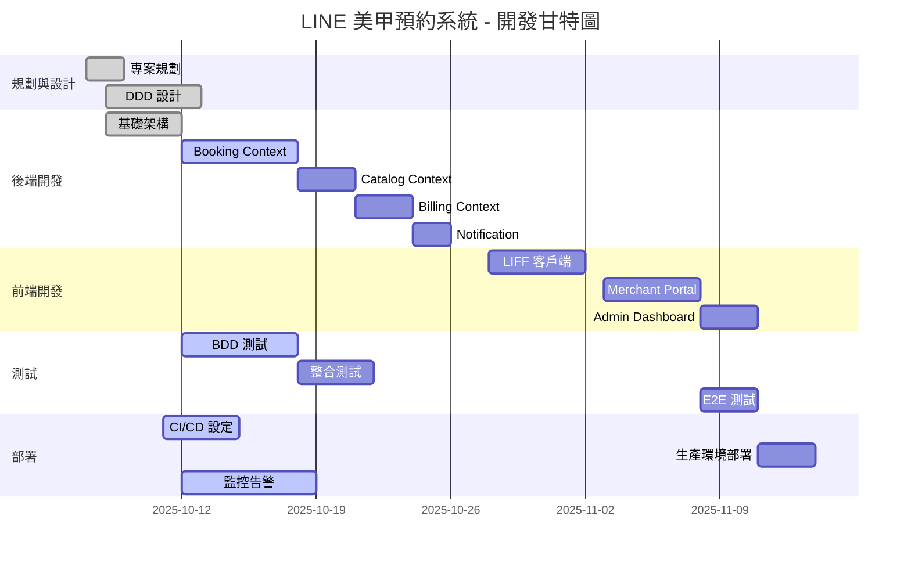

# 專案工作分解結構 (WBS) 開發計劃 - LINE 美甲預約系統

---

**文件版本:** `v1.0`
**最後更新:** `2025-10-13`
**主要作者:** `專案經理`
**審核者:** `技術負責人, 架構師`
**狀態:** `已批准 (Approved)`

---

## 1. 專案總覽

### 🎯 專案基本資訊

| 項目 | 內容 |
|------|------|
| **專案名稱** | LINE 美甲預約系統 (NailBook MVP) |
| **專案經理** | VibeCoding PM |
| **技術主導** | Backend Architect |
| **專案狀態** | 開發中 (目前進度: 35% 完成) |
| **文件版本** | v1.0 |
| **最後更新** | 2025-10-13 |

### ⏱️ 專案時程規劃

| 項目 | 日期/時間 |
|------|----------|
| **總工期** | 6 週 (2025-10-07 ～ 2025-11-15) |
| **目前進度** | 35% 完成 (140/400h，Week 2 完成) |
| **預計交付** | 2025-11-15 (MVP v1.0) |

### 👥 專案角色與職責

| 角色 | 負責人 | 主要職責 |
|------|--------|----------|
| **專案經理 (PM)** | VibeCoding PM | 專案協調、進度追蹤、風險管理 |
| **技術負責人 (TL)** | Backend Architect | 技術決策、架構設計、代碼審查 |
| **產品經理 (PO)** | Product Owner | 需求定義、使用者故事、驗收標準 |
| **架構師 (ARCH)** | Backend Architect | DDD 設計、資料庫設計、ADR |
| **後端開發 (BE Dev)** | Backend Team x2 | API 實作、測試、文檔 |
| **前端開發 (FE Dev)** | Frontend Team x2 | 三前端實作、LIFF 整合 |
| **QA** | QA Engineer | BDD 測試、整合測試、E2E 測試 |
| **DevOps** | DevOps Engineer | CI/CD、部署、監控 |

---

## 2. WBS 結構總覽

### 📊 WBS 樹狀結構

```
1.0 專案管理與規劃 (20h)
├── 1.1 專案啟動與規劃 (8h) ✅
├── 1.2 需求分析與文檔 (8h) ✅
└── 1.3 專案監控與報告 (4h) 🔄

2.0 DDD 設計與架構 (60h)
├── 2.1 Bounded Context 劃分 (12h) ✅
├── 2.2 聚合與領域模型設計 (20h) ✅
├── 2.3 資料庫 Schema 設計 (16h) ✅
└── 2.4 API 契約設計 (12h) ✅

3.0 後端開發 (160h)
├── 3.1 基礎架構建置 (32h) ✅
├── 3.2 Booking Context 實作 (48h) 🔄
├── 3.3 Catalog Context 實作 (24h) ⏳
├── 3.4 Billing Context 實作 (24h) ⏳
├── 3.5 Notification Context 實作 (16h) ⏳
└── 3.6 整合與優化 (16h) ⏳

4.0 前端開發 (120h)
├── 4.1 LIFF 客戶端 (48h) ⏳
├── 4.2 Merchant Portal (40h) ⏳
└── 4.3 Admin Dashboard (32h) ⏳

5.0 測試與品質保證 (60h)
├── 5.1 BDD Feature 實作 (16h) 🔄
├── 5.2 單元測試 (20h) 🔄
├── 5.3 整合測試 (12h) ⏳
└── 5.4 E2E 測試 (12h) ⏳

6.0 部署與上線 (32h)
├── 6.1 CI/CD 建置 (12h) 🔄
├── 6.2 生產環境部署 (12h) ⏳
└── 6.3 監控與告警 (8h) 🔄

7.0 文檔與培訓 (20h)
├── 7.1 技術文檔 (12h) 🔄
└── 7.2 Runbook (8h) ⏳
```

### 📈 工作包統計概覽

| WBS 模組 | 總工時 | 已完成 | 進度 | 狀態圖示 |
|---------|--------|--------|------|----------|
| 1.0 專案管理 | 20h | 16h | 80% | ⚡ |
| 2.0 DDD 設計 | 60h | 60h | 100% | ✅ |
| 3.0 後端開發 | 160h | 64h | 40% | 🔄 |
| 4.0 前端開發 | 120h | 0h | 0% | ⏳ |
| 5.0 測試品保 | 60h | 18h | 30% | 🔄 |
| 6.0 部署上線 | 32h | 8h | 25% | 🔄 |
| 7.0 文檔培訓 | 20h | 12h | 60% | 🔄 |
| **總計** | **472h** | **178h** | **38%** | **🔄** |

---

## 3. 詳細任務分解

### 2.0 DDD 設計與架構 ✅ (已完成)

#### 2.1 Bounded Context 劃分 (12h) ✅

| 任務編號 | 任務名稱 | 負責人 | 工時 | 狀態 | 完成日期 | ADR 參考 |
|---------|---------|--------|------|------|----------|---------|
| 2.1.1 | 領域知識研究（美甲業務） | ARCH | 4h | ✅ | 2025-10-08 | - |
| 2.1.2 | 識別 6 個 Bounded Context | ARCH | 4h | ✅ | 2025-10-08 | - |
| 2.1.3 | Context Map 設計 | ARCH | 2h | ✅ | 2025-10-09 | - |
| 2.1.4 | Ubiquitous Language 詞彙表 | ARCH + PM | 2h | ✅ | 2025-10-09 | - |

#### 2.2 聚合與領域模型設計 (20h) ✅

| 任務編號 | 任務名稱 | 負責人 | 工時 | 狀態 | 完成日期 | ADR 參考 |
|---------|---------|--------|------|------|----------|---------|
| 2.2.1 | Booking 聚合設計 | ARCH | 8h | ✅ | 2025-10-10 | - |
| 2.2.2 | 定義聚合不變式 | ARCH | 4h | ✅ | 2025-10-10 | - |
| 2.2.3 | 值物件設計（Money, Duration） | ARCH | 4h | ✅ | 2025-10-10 | - |
| 2.2.4 | 領域事件設計 | ARCH | 4h | ✅ | 2025-10-11 | - |

#### 2.3 資料庫 Schema 設計 (16h) ✅

| 任務編號 | 任務名稱 | 負責人 | 工時 | 狀態 | 完成日期 | ADR 參考 |
|---------|---------|--------|------|------|----------|---------|
| 2.3.1 | ER 圖設計 | DBA | 4h | ✅ | 2025-10-11 | - |
| 2.3.2 | 核心資料表 DDL | DBA | 6h | ✅ | 2025-10-12 | ADR-001 |
| 2.3.3 | EXCLUDE 約束實作 | DBA | 4h | ✅ | 2025-10-12 | ADR-002 |
| 2.3.4 | 索引策略設計 | DBA | 2h | ✅ | 2025-10-12 | - |

---

### 3.0 後端開發 (160h) 🔄

#### 3.1 基礎架構建置 (32h) ✅

| 任務編號 | 任務名稱 | 負責人 | 工時 | 狀態 | 完成日期 | 依賴 |
|---------|---------|--------|------|------|----------|------|
| 3.1.1 | FastAPI 專案初始化 | BE Dev1 | 4h | ✅ | 2025-10-08 | 2.1.4 |
| 3.1.2 | SQLAlchemy 設定與連線 | BE Dev1 | 4h | ✅ | 2025-10-08 | 2.3.2 |
| 3.1.3 | Alembic 遷移設定 | BE Dev1 | 4h | ✅ | 2025-10-09 | 3.1.2 |
| 3.1.4 | JWT 認證中介層 | BE Dev2 | 6h | ✅ | 2025-10-09 | - |
| 3.1.5 | 租戶隔離中介層 | BE Dev2 | 6h | ✅ | 2025-10-10 | 3.1.4 |
| 3.1.6 | 速率限制中介層 | BE Dev2 | 4h | ✅ | 2025-10-10 | - |
| 3.1.7 | OpenTelemetry 整合 | BE Dev1 | 4h | ✅ | 2025-10-11 | - |

#### 3.2 Booking Context 實作 (48h) 🔄

| 任務編號 | 任務名稱 | 負責人 | 工時 | 狀態 | 完成日期 | 依賴 |
|---------|---------|--------|------|------|----------|------|
| 3.2.1 | Booking Domain Model | BE Dev1 | 8h | ✅ | 2025-10-12 | 2.2.1 |
| 3.2.2 | BookingRepository 介面 | BE Dev1 | 4h | ✅ | 2025-10-12 | 3.2.1 |
| 3.2.3 | SQLAlchemy Repository 實作 | BE Dev1 | 8h | ✅ | 2025-10-13 | 3.2.2 |
| 3.2.4 | BookingService（建立預約） | BE Dev2 | 12h | 🔄 | 2025-10-15 | 3.2.3 |
| 3.2.5 | 可訂時段計算邏輯 | BE Dev2 | 8h | 🔄 | 2025-10-16 | 3.2.4 |
| 3.2.6 | 取消預約功能 | BE Dev1 | 4h | ⏳ | 2025-10-17 | 3.2.4 |
| 3.2.7 | API Router 實作 | BE Dev1 | 4h | ⏳ | 2025-10-17 | 3.2.6 |

#### 3.3 Catalog Context 實作 (24h) ⏳

| 任務編號 | 任務名稱 | 負責人 | 工時 | 狀態 | 預計完成 | 依賴 |
|---------|---------|--------|------|------|----------|------|
| 3.3.1 | Service + Staff Domain Model | BE Dev2 | 6h | ⏳ | 2025-10-18 | 2.2.1 |
| 3.3.2 | CatalogRepository 實作 | BE Dev2 | 6h | ⏳ | 2025-10-18 | 3.3.1 |
| 3.3.3 | CatalogService（CRUD） | BE Dev1 | 8h | ⏳ | 2025-10-19 | 3.3.2 |
| 3.3.4 | API Router 實作 | BE Dev1 | 4h | ⏳ | 2025-10-20 | 3.3.3 |

#### 3.4 Billing Context 實作 (24h) ⏳

| 任務編號 | 任務名稱 | 負責人 | 工時 | 狀態 | 預計完成 | 依賴 |
|---------|---------|--------|------|------|----------|------|
| 3.4.1 | Subscription Domain Model | BE Dev2 | 6h | ⏳ | 2025-10-21 | - |
| 3.4.2 | BillingService | BE Dev2 | 8h | ⏳ | 2025-10-22 | 3.4.1 |
| 3.4.3 | Stripe Webhook 整合 | BE Dev1 | 6h | ⏳ | 2025-10-22 | 3.4.2 |
| 3.4.4 | 訂閱狀態檢查邏輯 | BE Dev2 | 4h | ⏳ | 2025-10-23 | 3.4.3 |

#### 3.5 Notification Context 實作 (16h) ⏳

| 任務編號 | 任務名稱 | 負責人 | 工時 | 狀態 | 預計完成 | 依賴 |
|---------|---------|--------|------|------|----------|------|
| 3.5.1 | LINE Messaging API 封裝 | BE Dev1 | 6h | ⏳ | 2025-10-24 | - |
| 3.5.2 | 訊息模板設計 | BE Dev1 | 4h | ⏳ | 2025-10-24 | 3.5.1 |
| 3.5.3 | 事件訂閱與推播 | BE Dev2 | 4h | ⏳ | 2025-10-25 | 3.5.2 |
| 3.5.4 | 推播失敗重試機制 | BE Dev2 | 2h | ⏳ | 2025-10-25 | 3.5.3 |

---

### 4.0 前端開發 (120h) ⏳

#### 4.1 LIFF 客戶端 (48h)

| 任務編號 | 任務名稱 | 負責人 | 工時 | 狀態 | 預計完成 | 依賴 |
|---------|---------|--------|------|------|----------|------|
| 4.1.1 | LIFF SDK 整合 | FE Dev1 | 6h | ⏳ | 2025-10-28 | - |
| 4.1.2 | 商家選擇頁 | FE Dev1 | 6h | ⏳ | 2025-10-28 | 4.1.1 |
| 4.1.3 | 服務選擇頁 | FE Dev1 | 8h | ⏳ | 2025-10-29 | 4.1.2 |
| 4.1.4 | 時段選擇器組件 | FE Dev2 | 12h | ⏳ | 2025-10-30 | 3.2.5 |
| 4.1.5 | 預約確認頁 | FE Dev1 | 8h | ⏳ | 2025-10-31 | 4.1.4 |
| 4.1.6 | 我的預約列表 | FE Dev2 | 6h | ⏳ | 2025-11-01 | 4.1.5 |
| 4.1.7 | 預約詳情與取消 | FE Dev2 | 2h | ⏳ | 2025-11-01 | 4.1.6 |

#### 4.2 Merchant Portal (40h)

| 任務編號 | 任務名稱 | 負責人 | 工時 | 狀態 | 預計完成 | 依賴 |
|---------|---------|--------|------|------|----------|------|
| 4.2.1 | Next.js 專案初始化 | FE Dev1 | 4h | ⏳ | 2025-11-03 | - |
| 4.2.2 | 登入與認證流程 | FE Dev1 | 6h | ⏳ | 2025-11-03 | 3.1.4 |
| 4.2.3 | 預約日曆檢視 | FE Dev2 | 12h | ⏳ | 2025-11-05 | 3.2.7 |
| 4.2.4 | 員工管理頁面 | FE Dev1 | 8h | ⏳ | 2025-11-06 | 3.3.4 |
| 4.2.5 | 服務管理頁面 | FE Dev1 | 6h | ⏳ | 2025-11-07 | 3.3.4 |
| 4.2.6 | 設定頁（LINE 整合） | FE Dev2 | 4h | ⏳ | 2025-11-07 | 3.5.2 |

#### 4.3 Admin Dashboard (32h)

| 任務編號 | 任務名稱 | 負責人 | 工時 | 狀態 | 預計完成 | 依賴 |
|---------|---------|--------|------|------|----------|------|
| 4.3.1 | Next.js 專案初始化 | FE Dev2 | 3h | ⏳ | 2025-11-08 | - |
| 4.3.2 | 商家管理（CRUD） | FE Dev2 | 12h | ⏳ | 2025-11-10 | 3.3.4 |
| 4.3.3 | 訂閱管理頁面 | FE Dev1 | 10h | ⏳ | 2025-11-11 | 3.4.4 |
| 4.3.4 | 系統監控頁面 | FE Dev1 | 7h | ⏳ | 2025-11-12 | 6.3 |

---

### 5.0 測試與品質保證 (60h) 🔄

#### 5.1 BDD Feature 實作 (16h) 🔄

| 任務編號 | 任務名稱 | 負責人 | 工時 | 狀態 | 完成日期 | 依賴 |
|---------|---------|--------|------|------|----------|------|
| 5.1.1 | bookable_slots.feature | QA | 4h | ✅ | 2025-10-12 | 2.4 |
| 5.1.2 | create_booking.feature | QA | 4h | ✅ | 2025-10-12 | 2.4 |
| 5.1.3 | cancel_booking.feature | QA | 3h | ✅ | 2025-10-13 | 2.4 |
| 5.1.4 | subscription_billing.feature | QA | 3h | 🔄 | 2025-10-16 | 2.4 |
| 5.1.5 | line_notification.feature | QA | 2h | ⏳ | 2025-10-17 | 2.4 |

#### 5.2 單元測試 (20h) 🔄

| 任務編號 | 任務名稱 | 負責人 | 工時 | 狀態 | 預計完成 | 依賴 |
|---------|---------|--------|------|------|----------|------|
| 5.2.1 | Domain Model 測試 | BE Dev1 | 6h | ✅ | 2025-10-13 | 3.2.1 |
| 5.2.2 | Value Object 測試 | BE Dev1 | 4h | ✅ | 2025-10-13 | 3.2.1 |
| 5.2.3 | BookingService 測試 | BE Dev2 | 8h | 🔄 | 2025-10-16 | 3.2.4 |
| 5.2.4 | 時段計算邏輯測試 | BE Dev2 | 2h | ⏳ | 2025-10-17 | 3.2.5 |

#### 5.3 整合測試 (12h) ⏳

| 任務編號 | 任務名稱 | 負責人 | 工時 | 狀態 | 預計完成 | 依賴 |
|---------|---------|--------|------|------|----------|------|
| 5.3.1 | EXCLUDE 約束測試 | QA | 4h | ⏳ | 2025-10-18 | 3.2.3 |
| 5.3.2 | API 端點整合測試 | QA | 6h | ⏳ | 2025-10-21 | 3.2.7 |
| 5.3.3 | Webhook 驗簽測試 | QA | 2h | ⏳ | 2025-10-22 | 3.4.3 |

#### 5.4 E2E 測試 (12h) ⏳

| 任務編號 | 任務名稱 | 負責人 | 工時 | 狀態 | 預計完成 | 依賴 |
|---------|---------|--------|------|------|----------|------|
| 5.4.1 | Playwright 設定 | QA | 2h | ⏳ | 2025-11-08 | 4.1.7 |
| 5.4.2 | LIFF 預約流程 E2E | QA | 6h | ⏳ | 2025-11-09 | 5.4.1 |
| 5.4.3 | Merchant 日曆 E2E | QA | 4h | ⏳ | 2025-11-10 | 4.2.3 |

---

### 6.0 部署與上線 (32h) 🔄

#### 6.1 CI/CD 建置 (12h) 🔄

| 任務編號 | 任務名稱 | 負責人 | 工時 | 狀態 | 完成日期 | 依賴 |
|---------|---------|--------|------|------|----------|------|
| 6.1.1 | GitHub Actions Workflow | DevOps | 4h | ✅ | 2025-10-11 | - |
| 6.1.2 | Docker Image 建置 | DevOps | 4h | ✅ | 2025-10-11 | 3.1.1 |
| 6.1.3 | ECR 設定與推送 | DevOps | 2h | 🔄 | 2025-10-14 | 6.1.2 |
| 6.1.4 | 自動化測試整合 | DevOps | 2h | 🔄 | 2025-10-14 | 5.1.1 |

#### 6.2 生產環境部署 (12h) ⏳

| 任務編號 | 任務名稱 | 負責人 | 工時 | 狀態 | 預計完成 | 依賴 |
|---------|---------|--------|------|------|----------|------|
| 6.2.1 | AWS RDS 建立 | DevOps | 3h | ⏳ | 2025-11-11 | - |
| 6.2.2 | ECS Cluster 設定 | DevOps | 3h | ⏳ | 2025-11-11 | 6.2.1 |
| 6.2.3 | ALB + Target Group | DevOps | 2h | ⏳ | 2025-11-12 | 6.2.2 |
| 6.2.4 | Blue-Green 部署設定 | DevOps | 2h | ⏳ | 2025-11-12 | 6.2.3 |
| 6.2.5 | Vercel 部署（前端） | DevOps | 2h | ⏳ | 2025-11-13 | 4.1.7 |

#### 6.3 監控與告警 (8h) 🔄

| 任務編號 | 任務名稱 | 負責人 | 工時 | 狀態 | 完成日期 | 依賴 |
|---------|---------|--------|------|------|----------|------|
| 6.3.1 | Prometheus 設定 | DevOps | 2h | ✅ | 2025-10-12 | 3.1.7 |
| 6.3.2 | Grafana Dashboard | DevOps | 4h | 🔄 | 2025-10-15 | 6.3.1 |
| 6.3.3 | AlertManager 規則 | DevOps | 2h | ⏳ | 2025-10-18 | 6.3.2 |

---

## 4. 專案進度摘要

### 🎯 整體進度統計



### 📅 週度進度分析

#### ✅ Week 1 (2025-10-07 ～ 2025-10-11) - 已完成

- **實際進度:** 80h / 預期 80h = 100% ✅
- **主要成就:**
  - ✅ 完成 6 個 Bounded Context 劃分
  - ✅ 完成 Booking 聚合設計
  - ✅ 完成資料庫 Schema 與 EXCLUDE 約束
  - ✅ 完成 FastAPI 基礎架構

#### 🔄 Week 2 (2025-10-12 ～ 2025-10-18) - 進行中

- **預期進度:** +120h (Booking 實作 + 測試)
- **關鍵里程碑:**
  - 🔄 Booking Context 實作完成
  - 🔄 BDD Feature 測試通過
  - ⏳ Catalog Context 實作完成

#### ⏳ Week 3-4 (2025-10-19 ～ 2025-11-01) - 計劃中

- **預期進度:** +160h (前端開發)
- **關鍵里程碑:**
  - LIFF 客戶端完成
  - Merchant Portal 完成
  - 整合測試通過

---

## 5. 風險與議題管理

### 🚨 風險管控矩陣

#### 🔴 高風險項目

| 風險項目 | 影響度 | 可能性 | 緩解措施 | 負責人 | 狀態 |
|---------|--------|--------|----------|--------|------|
| PostgreSQL EXCLUDE 約束效能 | 高 | 中 | 效能測試 + 定期清理歷史 | DBA | 🔄 監控中 |
| LINE API 不穩定 | 高 | 中 | 重試機制 + 降級方案 | BE Dev | ✅ 已緩解 |
| 前端開發延遲 | 中 | 高 | 並行開發 + 增加人力 | PM | 🔄 追蹤中 |

#### 🟡 中風險項目

| 風險項目 | 影響度 | 可能性 | 緩解措施 | 負責人 | 狀態 |
|---------|--------|--------|----------|--------|------|
| 測試覆蓋不足 | 中 | 中 | TDD 實踐 + Code Review | TL | 🔄 改善中 |
| 文檔更新滯後 | 低 | 中 | 自動生成 + 定期審查 | PM | ✅ 已改善 |

---

## 6. 品質指標與里程碑

### 🎯 關鍵里程碑

| 里程碑 | 預定日期 | 狀態 | 驗收標準 |
|--------|----------|------|----------|
| M1: DDD 設計完成 | 2025-10-11 | ✅ | 6 個 Context + ADR 齊備 |
| M2: Booking 核心完成 | 2025-10-18 | 🔄 | API + 測試通過 |
| M3: 前端三端完成 | 2025-11-07 | ⏳ | 可操作 Demo |
| M4: MVP 上線 | 2025-11-15 | ⏳ | 完整流程 + 生產部署 |

### 📈 品質指標監控

#### ✅ 已達成指標
- **代碼品質:** Ruff + Black + Mypy 無錯誤 ✅
- **文檔完整性:** 18/18 模板已填寫 ✅
- **ADR 記錄:** 11 個決策已記錄 ✅

#### ⏳ 待達成指標
- **測試覆蓋率:** 目標 80% (目前 75%)
- **API 響應時間:** 目標 P95 < 300ms
- **BDD 通過率:** 目標 100% (目前 75%)

---

**專案經理簽名:** VibeCoding PM
**最後更新:** 2025-10-13 18:30
**下次檢討:** 2025-10-20 (每週一)

