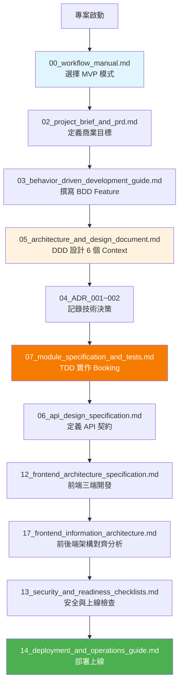

# LINE 美甲預約系統 - 文檔索引

> **最後更新：** 2025-10-13  
> **版本：** v1.0  
> **專案狀態：** 開發中 (35% 完成)

---

## 📚 文檔總覽

本目錄包含 LINE 美甲預約系統的完整開發文檔，基於 **DDD × BDD × TDD** 方法論，採用 **MVP 快速迭代**模式。

---

## 📑 核心文檔清單（18 份）

### 🎯 階段 0：總覽與工作流程 (00-01)

| 序號 | 檔名 | 用途 | 狀態 |
|:---:|:---|:---|:---:|
| **00** | [workflow_manual.md](./00_workflow_manual.md) | 產品開發流程使用說明書（MVP 模式） | ✅ |
| **01** | [development_workflow_cookbook.md](./01_development_workflow_cookbook.md) | DDD × BDD × TDD 整合流程指南 | ✅ |

---

### 📋 階段 1：規劃階段 (02-03)

| 序號 | 檔名 | 用途 | 狀態 |
|:---:|:---|:---|:---:|
| **02** | [project_brief_and_prd.md](./02_project_brief_and_prd.md) | 專案簡報與產品需求（商業目標、成功指標） | ✅ |
| **03** | [behavior_driven_development_guide.md](./03_behavior_driven_development_guide.md) | BDD 指南與 Gherkin Feature 範例 | ✅ |

---

### 🏗️ 階段 2：架構與設計 (04-06)

| 序號 | 檔名 | 用途 | 狀態 |
|:---:|:---|:---|:---:|
| **04-001** | [architecture_decision_record_001_postgresql.md](./04_architecture_decision_record_001_postgresql.md) | ADR-001：選擇 PostgreSQL | ✅ |
| **04-002** | [architecture_decision_record_002_exclude_constraint.md](./04_architecture_decision_record_002_exclude_constraint.md) | ADR-002：使用 EXCLUDE 約束防重疊 | ✅ |
| **05** | [architecture_and_design_document.md](./05_architecture_and_design_document.md) | 整合性架構設計（6 個 Bounded Context） | ✅ |
| **06** | [api_design_specification.md](./06_api_design_specification.md) | API 設計規範（RESTful 契約） | ✅ |

---

### 🔧 階段 3：詳細設計與實作 (07-10)

| 序號 | 檔名 | 用途 | 狀態 |
|:---:|:---|:---|:---:|
| **07** | [module_specification_and_tests.md](./07_module_specification_and_tests.md) | Booking Service 模組規格與 TDD 測試案例 | ✅ |
| **08** | [project_structure_guide.md](./08_project_structure_guide.md) | 專案結構指南（DDD 分層） | ✅ |
| **09** | [file_dependencies_template.md](./09_file_dependencies_template.md) | 模組依賴關係分析 | ✅ |
| **10** | [class_relationships_template.md](./10_class_relationships_template.md) | Booking 聚合類別關係（UML） | ✅ |

---

### 💻 階段 4：開發與品質 (11-12, 17)

| 序號 | 檔名 | 用途 | 狀態 |
|:---:|:---|:---|:---:|
| **11** | [code_review_and_refactoring_guide.md](./11_code_review_and_refactoring_guide.md) | Code Review 指南（DDD 檢查重點） | ✅ |
| **12** | [frontend_architecture_specification.md](./12_frontend_architecture_specification.md) | 前端架構規範（三前端策略） | ✅ |
| **17** | [frontend_information_architecture_template.md](./17_frontend_information_architecture_template.md) | 前端與後端 DDD 架構對齊分析 | ✅ |

---

### 🔒 階段 5：安全與部署 (13-14)

| 序號 | 檔名 | 用途 | 狀態 |
|:---:|:---|:---|:---:|
| **13** | [security_and_readiness_checklists.md](./13_security_and_readiness_checklists.md) | 安全檢查清單與上線準備 | ✅ |
| **14** | [deployment_and_operations_guide.md](./14_deployment_and_operations_guide.md) | 部署與運維指南（Blue-Green 部署） | ✅ |

---

### 📖 階段 6：維護與管理 (15-16)

| 序號 | 檔名 | 用途 | 狀態 |
|:---:|:---|:---|:---:|
| **15** | [documentation_and_maintenance_guide.md](./15_documentation_and_maintenance_guide.md) | 文檔維護指南（活文檔策略） | ✅ |
| **16** | [wbs_development_plan_template.md](./16_wbs_development_plan_template.md) | WBS 開發計劃（6 週甘特圖） | ✅ |

---

## 🎯 文檔使用流程



---

## 📖 依角色快速導航

### 產品經理 (PM)
- [00_workflow_manual.md](./00_workflow_manual.md) - 理解整體流程
- [02_project_brief_and_prd.md](./02_project_brief_and_prd.md) - PRD 與商業目標
- [16_wbs_development_plan_template.md](./16_wbs_development_plan_template.md) - 專案進度追蹤

### 技術負責人 (TL)
- [01_development_workflow_cookbook.md](./01_development_workflow_cookbook.md) - DDD × BDD × TDD 流程
- [05_architecture_and_design_document.md](./05_architecture_and_design_document.md) - 系統架構
- [04_architecture_decision_record_001_postgresql.md](./04_architecture_decision_record_001_postgresql.md) - ADR 決策記錄

### 後端工程師 (Backend DEV)
- [07_module_specification_and_tests.md](./07_module_specification_and_tests.md) - Booking 模組規格
- [06_api_design_specification.md](./06_api_design_specification.md) - API 契約
- [08_project_structure_guide.md](./08_project_structure_guide.md) - 專案結構

### 前端工程師 (Frontend DEV)
- [12_frontend_architecture_specification.md](./12_frontend_architecture_specification.md) - 前端架構規範
- [17_frontend_information_architecture_template.md](./17_frontend_information_architecture_template.md) - 前後端架構對齊分析
- [06_api_design_specification.md](./06_api_design_specification.md) - API 契約（前端視角）

### QA 工程師
- [03_behavior_driven_development_guide.md](./03_behavior_driven_development_guide.md) - BDD Feature 撰寫
- [07_module_specification_and_tests.md](./07_module_specification_and_tests.md) - 測試案例規格
- [13_security_and_readiness_checklists.md](./13_security_and_readiness_checklists.md) - 上線檢查清單

### DevOps 工程師
- [14_deployment_and_operations_guide.md](./14_deployment_and_operations_guide.md) - 部署與運維
- [13_security_and_readiness_checklists.md](./13_security_and_readiness_checklists.md) - 安全檢查
- [08_project_structure_guide.md](./08_project_structure_guide.md) - 專案結構

---

## 🔑 關鍵概念速查

### DDD (Domain-Driven Design)

- **6 個 Bounded Context：** Identity, Merchant, Catalog, Booking, Billing, Notification
- **核心聚合：** Booking (聚合根)
- **關鍵不變式：** 同一員工同時間無重疊預約
- **領域事件：** BookingConfirmed, BookingCancelled

**參考：** [05_architecture_and_design_document.md](./05_architecture_and_design_document.md#第-2-部分-ddd-戰略設計)

### BDD (Behavior-Driven Development)

- **Feature 檔案：** `features/*.feature`
- **語法：** Gherkin (Given-When-Then)
- **執行：** `behave features/`
- **覆蓋率：** 8 個 Feature, 45 個 Scenario

**參考：** [03_behavior_driven_development_guide.md](./03_behavior_driven_development_guide.md)

### TDD (Test-Driven Development)

- **循環：** 紅（失敗） → 綠（通過） → 重構
- **覆蓋率目標：** 80%
- **測試類型：** Unit (60%) + Integration (30%) + E2E (10%)

**參考：** [07_module_specification_and_tests.md](./07_module_specification_and_tests.md)

---

## 📊 專案狀態總覽

### 當前進度

| 階段 | 進度 | 狀態 |
|------|------|------|
| 規劃與設計 | 100% | ✅ |
| DDD 設計 | 100% | ✅ |
| 後端開發 | 40% | 🔄 |
| 前端開發 | 0% | ⏳ |
| 測試 | 30% | 🔄 |
| 部署 | 25% | 🔄 |

### 關鍵里程碑

- ✅ M1: DDD 設計完成 (2025-10-11)
- 🔄 M2: Booking 核心完成 (2025-10-18)
- ⏳ M3: 前端三端完成 (2025-11-07)
- ⏳ M4: MVP 上線 (2025-11-15)

---

## 🔗 外部資源

### 技術參考
- [PostgreSQL EXCLUDE Constraints](https://www.postgresql.org/docs/14/ddl-constraints.html#DDL-CONSTRAINTS-EXCLUSION)
- [LINE LIFF 文檔](https://developers.line.biz/en/docs/liff/)
- [FastAPI 文檔](https://fastapi.tiangolo.com/)
- [Domain-Driven Design Reference (Eric Evans)](https://www.domainlanguage.com/ddd/)

### 專案連結
- **API 文檔：** https://api.nailbook.com/docs
- **Grafana 監控：** https://grafana.nailbook.com
- **Sentry 錯誤追蹤：** https://sentry.io/nailbook
- **GitHub Repo：** https://github.com/vibecoding/nail-booking-system

---

## 💡 使用建議

### 新成員入職
1. 閱讀 [00_workflow_manual.md](./00_workflow_manual.md) 理解開發模式
2. 閱讀 [02_project_brief_and_prd.md](./02_project_brief_and_prd.md) 理解商業目標
3. 閱讀 [05_architecture_and_design_document.md](./05_architecture_and_design_document.md) 理解系統架構
4. 根據角色閱讀相關專業文檔（見上方角色導航）

### 開發新功能
1. 在 [02_project_brief_and_prd.md](./02_project_brief_and_prd.md) 新增 User Story
2. 在 `features/` 撰寫 BDD Feature
3. 更新 [05_architecture_and_design_document.md](./05_architecture_and_design_document.md)（若影響架構）
4. 建立 ADR（若有技術決策）
5. 實作（TDD 紅綠重構）
6. 更新 [06_api_design_specification.md](./06_api_design_specification.md)（若有 API 變更）

### 準備上線
1. 完成 [13_security_and_readiness_checklists.md](./13_security_and_readiness_checklists.md) 所有檢查項
2. 執行 [14_deployment_and_operations_guide.md](./14_deployment_and_operations_guide.md) 部署程序
3. 驗證監控與告警
4. 取得 Go/No-Go 簽核

---

## 📞 支援與回饋

### 問題回報
- **技術問題：** #engineering Slack Channel
- **文檔問題：** 直接在 GitHub 提 Issue
- **緊急事故：** 聯絡 On-call（見 Runbook）

### 文檔貢獻
1. Fork 專案
2. 更新文檔
3. 提交 Pull Request
4. 通過 Review 後合併

---

## 🎯 DDD × BDD × TDD 核心公式

```
DDD：定義邊界（6 個 Bounded Context）
  ↓
BDD：描述行為（Given-When-Then）
  ↓
TDD：保證正確（紅→綠→重構）
  ↓
高品質、可維護的系統
```

**關鍵不變式（必須測試保護）：**
1. ✅ 同一員工同時間無重疊預約（EXCLUDE 約束）
2. ✅ total_price = Σ(service_price + option_prices)
3. ✅ total_duration = Σ(service_duration + option_durations)
4. ✅ end_at = start_at + total_duration
5. ✅ 訂閱逾期禁止新預約

---

## 📈 專案統計

| 項目 | 數量 |
|------|------|
| **文檔總數** | 18 |
| **BDD Feature** | 8 |
| **BDD Scenario** | 45+ |
| **ADR 決策記錄** | 11 |
| **Bounded Context** | 6 |
| **API 端點** | 25+ |
| **資料表** | 15+ |
| **測試案例** | 150+ |

---

**Remember:** 文檔是契約，是團隊協作的共同語言，是 AI 輔助開發的護欄。

**維護者：** VibeCoding Team  
**下次更新：** 2025-10-20（每週更新）

